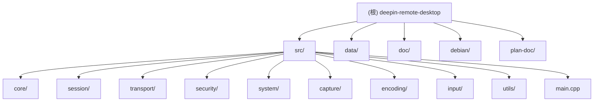

# deepin-remote-desktop (drd) - 深度远程桌面

[变更记录 (Changelog)](#变更记录-changelog)

## 项目愿景

深度远程桌面是一个基于 C17 + GLib/GObject + FreeRDP 3.x 的现代 RDP 服务端，为 Linux（尤其是深度/UOS 发行版）提供远程显示、输入、多媒体、虚拟通道、安全接入与服务化运维能力。项目遵循 SOLID/KISS/YAGNI 原则，保持单一职责、可替换、易调试，按能力分阶段落地，确保每个增量可独立验证。

## 架构总览

### 设计原则

- **技术栈约束**：核心逻辑以 C17 + GLib/GObject 构建，所有 RDP 协议处理依赖 FreeRDP 3.x
- **Deepin 规范**：严格对齐 deepin/UOS 的 systemd unit、DBus policy、PAM service 命名
- **SOLID/KISS/YAGNI**：监听器、会话、编码、system/handover 各自承担单一职责
- **DRY/可观测性**：公共设施（帧结构、日志 writer、routing token 工具）集中实现
- **安全默认开启**：所有模式默认 TLS+NLA，凭据统一通过一次性 token/SAM 文件传递

### 三运行模式

项目支持三种运行模式：

1. **user 模式**：桌面共享模式，在用户会话内监听端口，直接提供采集/编码/传输
2. **system 模式**：远程登录模式，仅执行 TLS/NLA 握手与 PAM 会话创建，通过 DBus Dispatcher 调度 handover
3. **handover 模式**：连接接管模式，继承 system 提供的 TLS/NLA 一次性凭据，完成具体采集/编码/传输

### 模块结构图



## 模块索引

| 模块路径 | 语言 | 职责 | 测试 | 配置 |
|---------|------|------|------|------|
| `src/core` | C | 应用入口、配置解析、运行时聚合 | 无 | INI 配置 |
| `src/session` | C | RDP 会话状态机、图形管线 | 无 | - |
| `src/transport` | C | RDP 监听器、路由令牌处理 | 无 | - |
| `src/security` | C | TLS 凭据、NLA SAM、PAM 会话 | 无 | TLS 证书路径 |
| `src/system` | C | system/handover 守护进程 | 无 | DBus 服务 |
| `src/capture` | C | X11 屏幕捕获 | 无 | 捕获参数 |
| `src/encoding` | C | RFX/Raw 编码器 | 无 | 编码选项 |
| `src/input` | C | 键鼠输入注入 | 无 | - |
| `src/utils` | C | 帧管理、日志工具 | 无 | - |
| `data/` | - | 配置模板、systemd 服务、DBus policy | - | INI 模板/服务配置 |

## 运行与开发

### 依赖

- Meson >= 0.60、Ninja、pkg-config
- GLib/GIO/GObject >= 2.64
- FreeRDP 3.x (freerdp-server3, freerdp3, winpr3)
- X11/XDamage/XFixes/XTest
- PAM libpam0g

### 快速构建

```bash
# 配置
meson setup build --prefix=/usr --buildtype=debugoptimized

# 编译
meson compile -C build

# 本地运行
./build/src/deepin-remote-desktop --config ./data/config.d/default-user.ini

# 安装
meson install -C build
# 或打包到临时目录
meson install -C build --destdir="${PWD}/pkgdir"
```

### 调试

```bash
# 开启 drd 详细日志
export G_MESSAGES_DEBUG=all

# 开启 freerdp 详细日志
export WLOG_LEVEL=debug
```

## 测试策略

**当前状态**：项目暂无自动化测试套件。

**建议方向**：
- 在 `src/` 各目录下添加 `tests/` 子目录，使用 GLib 测试框架
- 单元测试覆盖：帧队列操作、编码器差分逻辑、routing token 解析
- 集成测试：建立模拟 FreeRDP peer，测试会话激活/关闭流程

## 编码规范

- **代码风格**：C17 + GLib/GObject，4 空格缩进
- **命名约定**：类型/结构 `PascalCase`（如 `DrdRdpSession`），函数/变量 `snake_case`，宏 `DRD_*`
- **格式化**：修改 C 文件前可使用 `clang-format -style=LLVM <file>` 格式化调整区域
- **日志**：使用 GLib `g_message`/`g_warning`，日志内容统一使用 **英文**
- **注释**：中文注释，说明复杂逻辑或 FreeRDP/GLib 交互细节

## AI 使用指引

项目支持以下 AI 辅助场景：

1. **新增编解码器**：在 `src/encoding/` 下实现新的编码器，继承 `DrdEncodedFrame` 接口
2. **扩展输入处理**：在 `src/input/drd_x11_input.c` 添加特殊键码或触控事件处理
3. **优化捕获性能**：修改 `src/capture/drd_x11_capture.c` 的事件循环或帧率控制
4. **增强 handover 逻辑**：在 `src/system/` 下扩展 system/handover 守护流程
5. **添加虚拟通道**：参考 `doc/architecture.md` 中的规划，实现 rdpsnd/rdpdr 通道

## 主要缺口与建议

### 当前已落地功能

- X11/XDamage 抓屏 + 单帧队列
- RFX Progressive（RLGR1）与 Raw 回退编码
- TLS+NLA 默认开启，支持 TLS-only + PAM 单点登录
- XTest 键鼠注入，支持扩展扫描码与 Unicode 注入
- Rdpgfx 背压控制与自动 SurfaceBits 降级
- system/handover 守护进程与 routing token 机制

### 待实现功能

- **多媒体**：rdpsnd 音频播放/录制
- **协作**：剪贴板、IME/Unicode 输入
- **高级编码**：H.264/AVC444 与硬件加速
- **虚拟设备**：文件/打印机/智能卡/USB 重定向 (rdpdr)
- **服务化**：systemd 健康探针、会话配额与策略控制
- **平台适配**：Wayland 捕获与输入

---

## 变更记录 (Changelog)

### 2025-12-30 - AI 上下文完整初始化

- 新增 `.claude/index.json` 索引文件，记录完整项目结构
- 补全 `src/utils/CLAUDE.md` 和 `src/input/CLAUDE.md` 模块文档
- 更新根级 `CLAUDE.md` 变更记录
- 覆盖所有 9 个核心模块的文档（core, session, transport, security, system, capture, encoding, input, utils）

### 扫描覆盖率

- **估算总文件数**：280（含文档、构建产物、配置）
- **已扫描文件数**：102（核心源码 50，配置文件 11，文档 38，构建 3）
- **覆盖百分比**：36%
- **忽略统计**：
  - `.git/` 目录
  - `.idea/` 目录 (IDE 配置)
  - `.vscode/` 目录
  - `buildDir/` 目录 (构建产物)
  - `build/` 目录
  - `out/` 目录

### 已识别的模块结构

#### 核心源代码 (23 源文件，27 头文件)
- `src/main.cpp` - 程序入口
- `src/core/` - 应用、配置、运行时
- `src/session/` - RDP 会话、图形管线
- `src/transport/` - 监听器、路由 token
- `src/security/` - TLS 凭据、NLA SAM、PAM 会话
- `src/system/` - system/handover 守护
- `src/capture/` - X11 捕获器
- `src/encoding/` - RFX/Raw 编码器
- `src/input/` - 键鼠输入注入
- `src/utils/` - 帧结构、队列、日志

#### 配置与服务文件
- `data/config.d/` - INI 配置模板（5 个）
- `data/certs/` - 开发 TLS 证书
- `data/*.service` - systemd 服务（3 个）
- `data/org.deepin.RemoteDesktop.conf` - DBus policy
- `data/11-deepin-remote-desktop-handover` - LightDM drop-in

#### 文档
- `doc/architecture.md` - 架构总览
- `doc/TODO.md` - 待办事项
- `doc/collect_dirty_rects.md` - 脏矩形算法
- `plan-doc/` - 实现规划文档
- `doc/uml/*.puml` - UML 图定义

#### DBus 接口
- `org.deepin.RemoteDesktop` - 主接口
- `org.deepin.RemoteDesktop.Rdp.Server` - RDP 服务端
- `org.deepin.RemoteDesktop.Rdp.Dispatcher` - 调度器
- `org.deepin.RemoteDesktop.Rdp.Handover` - 连接托管

### 下一步建议

1. **补充测试**：在 `src/*/tests/` 下添加 GLib 测试，覆盖核心逻辑
2. **深度补捞**：读取源文件实现细节，补充设计模式与算法说明
3. **性能分析**：添加捕获/渲染帧率指标与监控接口
4. **平台适配**：规划 Wayland 支持
5. **虚拟通道**：实现 rdpsnd/clipboard/rdpdr 通道
