# Deepin Remote Desktop (drd) 架构概览

## 愿景与范围
- 定位为 Linux 上的现代 RDP 服务端，覆盖远程显示/输入、多媒体、虚拟通道、安全接入与服务化运维。
- 以 C(GLib/GObject) + FreeRDP 为主干，保持单一职责、可替换、易调试；按能力分阶段落地，确保每个增量可独立验证。
- 模块化运行时：应用入口 → 配置/安全 → 采集 & 编码 → RDP 传输 → 虚拟通道/设备 → 服务治理（监控、策略、自动化恢复）。

## 设计原则
- **技术栈约束**：核心逻辑以 C17 + GLib/GObject 构建，所有 RDP 协议处理依赖 FreeRDP 3.x；UI/LightDM 扩展采用 Typst/DBus 文档约定，保持跨发行版可移植性。
- **Deepin 规范**：严格对齐 deepin/UOS 的 systemd unit、DBus policy、PAM service 命名，运行用户与权限配置均遵循发行版安全基线。
- **SOLID/KISS/YAGNI**：监听器、会话、编码、system/handover、LightDM Seat 各自承担单一职责；抽象层（如 `DrdServerRuntime`、`DrdRdpGraphicsPipeline`、`DrdRemoteClient`）稳定，对象替换不影响调用方；仅实现当前必须的能力，延伸功能（rdpsnd、Clipboard、SSO API）通过 TODO/规划记录。
- **DRY/可观测性**：公共设施（帧结构、日志 writer、routing token 工具）集中实现，全局日志沿用统一 writer，避免在 handover/system 模式中产生重复实现。
- **安全默认开启**：所有模式默认 TLS+NLA，只有在显式 `--disable-nla`/`[auth] enable_nla=false` 时才切换 PAM SSO；凭据统一通过一次性 token/SAM 文件传递，handover/take client 不接触真实账号密码。

## 系统组件视图

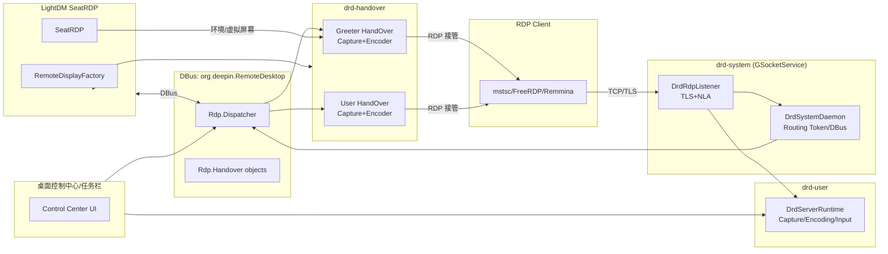

- `drd-system` 以 root/`deepin-remote-desktop` 用户托管监听端口与 routing token，负责调度 handover。
- `drd-handover` 运行在 greeter 与用户会话，继承 system 提供的 TLS/NLA 一次性凭据，完成具体采集/编码/传输。
- `drd-user` 为桌面共享模式的常驻进程，直接在用户会话内监听端口。
- LightDM RemoteDisplayFactory/SeatRDP 通过 DBus 与 system/handover 交互，创建远程 seat、管理虚拟屏幕，并与 UI 控制中心共享状态。

## 当前能力概览
- **显示/编码**：X11/XDamage 抓屏 + 单帧队列，RFX Progressive（默认 RLGR1）与 Raw 回退，关键帧/上下文管理齐备。
- **传输**：FreeRDP 监听 + TLS/NLA 强制，渲染线程串行“等待帧→编码→Rdpgfx/SurfaceBits 发送”，具备 ACK 背压与自动回退逻辑。
- **输入**：XTest 键鼠注入，扩展扫描码拆分，指针缩放改为预计算比例减少每次浮点除法，并在 RDP → X11 键码转换环节新增缓存避免重复查表；Unicode 注入通过 `XKeysymToKeycode` 直接构造 KeySym 并注入，常见控制字符（Tab/Enter/Backspace）同样可用。
- **配置/安全**：INI/CLI 合并，TLS 凭据集中加载，NLA SAM 临时文件确保 CredSSP，拒绝回退纯 TLS/RDP。
- **可观测性**：关键路径日志保持英语，文档/计划与源码同步更新，便于跟踪 renderer、Rdpgfx、会话生命周期。

### 日志链路与观测
- `drd_log_init()` 统一安装 `g_log_set_writer_func()`，所有 `DRD_LOG_*` 宏会通过 `g_log_structured_standard()` 注入 domain/level/file/line/func 元信息，保证 system/handover 场景都能拿到同一格式。
- 自定义 `drd_log_writer()` 仅在栈上拼装 `domain-level [file:line func]: message`，随后把 `GString` 的 buffer 直接写入 `STDERR_FILENO`。这样可以绕开 `g_printerr()` 内部的 `g_convert()/iconv_open()`，避免在 GLib 日志锁内重复初始化 locale 造成 `malloc/tcache` 重入崩溃。
- 该 writer 只依赖 `write()`，能够在 handover/system 等多线程环境下稳定输出日志，并且在崩溃路径中仍可安全调用。

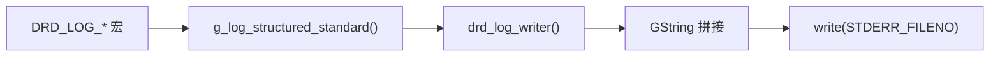

## 模块分层

### 1. 核心层
- `core/drd_application`：负责命令行解析、GLib 主循环、信号处理与监听器启动，并在 CLI/配置合并后记录生效参数及配置来源，确保 TLS 凭据只实例化一次（由 Meson 直接链接进 `deepin-remote-desktop` 可执行文件，不再生成单独静态库）。
- `core/drd_server_runtime`：聚合 Capture/Encoding/Input 子系统，`drd_server_runtime_set_encoding_options()` 会在配置合并阶段写入分辨率/编码参数；`prepare_stream()` 仅在 `DrdRdpSession::Activate` 成功后被调用，一次性启动 capture/input/encoder 并标记 `stream_running`，使 `drd_rdp_listener_session_closed()` 能在会话全部断开时安全 `stop()`；`pull_encoded_frame()` 每次直接从 `DrdCaptureManager` 拉取最新帧并同步调用 `DrdEncodingManager` 编码，`set_transport()` 用于在 SurfaceBits 与 Rdpgfx 之间切换并强制关键帧。
- `core/drd_config`：解析 INI/CLI 配置，集中管理绑定地址、TLS 证书、捕获尺寸及 `enable_nla`/`pam_service` 等安全参数。
- `security/drd_tls_credentials`：加载并缓存 TLS 证书/私钥，供运行时向 FreeRDP Settings 注入。
- `security/drd_nla_sam`：基于用户名/密码生成临时 SAM 文件，写入 `FreeRDP_NtlmSamFile`，允许 CredSSP 在 NLA 期间读取 NT 哈希。
- `security/drd_local_session`：在关闭 NLA（TLS+PAM 单点登录）时运行，使用 PAM 完成 `pam_authenticate/pam_open_session`，生成可供 capture/input 复用的本地用户上下文，并负责凭据擦除与 `pam_close_session`。

### 2. 采集层
- `capture/drd_capture_manager`：启动/停止屏幕捕获，维护帧队列。
- `capture/drd_x11_capture`：X11/XShm 抓屏线程，侦听 XDamage 并推送帧；damage 会合并并按 `target_interval` 节流，避免事件风暴直接抬高帧率；线程使用 `g_poll()` 同时监听 X11 连接与 wakeup pipe，`drd_x11_capture_stop()` 会写入 pipe 唤醒线程，避免 `XNextEvent()` 长时间阻塞导致 stop 卡死。
- `utils/drd_frame_queue`：帧队列由单帧缓存升级为 3 帧环形缓冲，push 时若满会丢弃最旧帧并计数，可通过 `drd_frame_queue_get_dropped_frames()` 获取累计丢帧数，帮助诊断 encoder 背压。
（capture/encoding/input/utils 源文件直接编译进主程序，无需构建中间静态库）

### 3. 编码层
- `encoding/drd_encoding_manager`：统一编码配置、调度；对外暴露帧编码接口，并在 Progressive 超出多片段限制时自动回退 RAW。
- `encoding/drd_raw_encoder`：原始帧编码器（BGRX → bottom-up），兼容旧客户端。
- `encoding/drd_rfx_encoder`：基于 RemoteFX 的压缩实现，支持帧差分与底图缓存；Progressive 路径固定使用 RLGR1（`rfx_context_set_mode(RLGR1)`）保持与 mstsc/gnome-remote-desktop 一致，SurfaceBits 仍以 RLGR3 为主。其 `collect_dirty_rects()` 采用“tile 哈希 + 按需逐行校验”收集脏矩形，并直接生成 `RFX_RECT` 输入，详见 `doc/collect_dirty_rects.md`。为避免客户端 `MultifragMaxRequestSize` 过小导致每帧都先压缩再回退原始帧，`DrdEncodingManager` 会在检测到多片段超限后进入一段“raw grace” 周期，直接输出原始帧并跳过 RFX 压缩，待若干帧或上限增大后再尝试 RFX，减少重复编码开销。

### 4. 输入层
- `input/drd_input_dispatcher`：键鼠事件注入入口，管理 X11 注入后端与 FreeRDP 回调。
- `input/drd_x11_input`：基于 XTest 的实际注入实现，负责键盘、鼠标、滚轮事件，并在启动时读取真实桌面分辨率、根据编码流尺寸动态缩放坐标；同时在注入键盘事件时会把扩展按键的第 9 位（0xE0）剥离，只向 `freerdp_keyboard_get_x11_keycode_from_rdp_scancode()` 传递 8-bit scan code 与独立的 `extended` 标记，避免方向键等扩展扫描码超出 0–255 范围；若 FreeRDP 的旧映射返回 0（常见于 Alt/AltGr 等修饰键），则退回到 `XKeysymToKeycode()` 基于键值的查找，以确保修饰键必然可注入。

### 5. 传输层
- `transport/drd_rdp_listener`：直接继承 `GSocketService`，通过 `g_socket_listener_add_*` 绑定端口，`incoming` 信号里将 `GSocketConnection` 的 fd 复制给 `freerdp_peer`，再复用既有 TLS/NLA/输入配置流程，整个监听循环交由 GLib 主循环驱动；运行模式改为 `DrdRuntimeMode` 三态驱动：system 模式触发被动会话/输入屏蔽 + delegate/cancellable，handover 模式自动启用 RDSTLS，其余场景按 user 模式执行；失败分支统一复用内部连接/peer 清理函数，避免重复关闭/释放遗漏。
- `session/drd_rdp_session`：会话状态机，维护 peer/runtime 引用、虚拟通道、事件线程与 renderer 线程。`drd_rdp_session_render_thread()` 在激活后循环：等待 Rdpgfx 容量（带 1 秒超时，无法及时 ACK 时自动回退 SurfaceBits）→ 调用 `drd_server_runtime_pull_encoded_frame()`（同步等待并编码，累计错误次数）→ 优先提交 Progressive，失败则回退 SurfaceBits（Raw 帧按行分片避免超限 payload），并负责 transport 切换、关键帧请求与桌面大小校验。
- `session/drd_rdp_graphics_pipeline`：Rdpgfx server 适配器，负责与客户端交换 `CapsAdvertise/CapsConfirm`，在虚拟通道上执行 `ResetGraphics`/Surface 创建/帧提交；内部用 `needs_keyframe` 防止增量帧越级，并用 `capacity_cond`/`outstanding_frames` 控制 ACK 背压，当 Progressive 管线就绪时驱动运行时切换编码模式。
- `frame_acks_suspended` 状态机：当客户端发送 `queueDepth = SUSPEND_FRAME_ACKNOWLEDGEMENT` 时立刻清空未确认帧并广播 `capacity_cond`，编码线程不再累积 `outstanding_frames`；下一个普通 ACK 抵达后自动恢复背压。这样避免长时间不 ACK 时 `outstanding_frames` 无上限膨胀，也保证 resume 后重新以 0 起步。

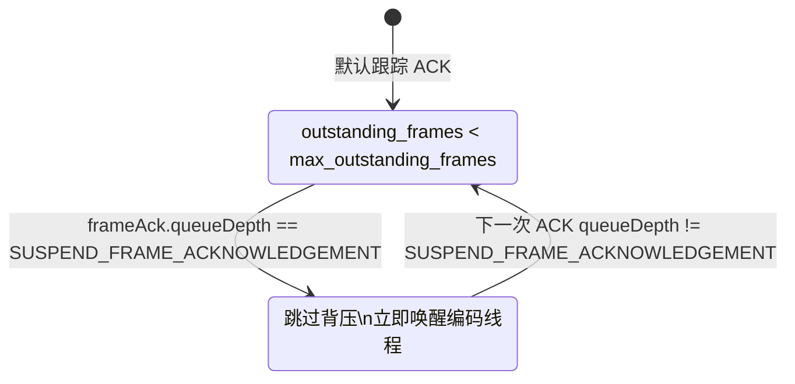

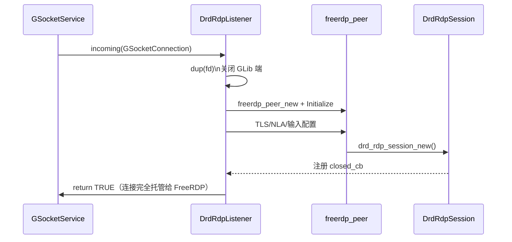

### 6. 运行模式与 System/Handover
- **`DrdRuntimeMode` 三态**：
  1. `user`：默认模式，单进程负责采集/编码/监听，直接通过 `DrdRdpListener` 服务客户端。
  2. `system`：仅在 root/systemd 下使用，`DrdApplication` 跳过采集/编码，实例化 `DrdSystemDaemon`。system daemon 在 GLib `incoming` 勾子中先透过 `DrdRoutingTokenInfo` 窥探 `Cookie: msts=<routing-token>`，把 socket + token 包装成 `DrdRemoteClient`，注册成 `org.deepin.RemoteDesktop.Rdp.Handover` skeleton 并挂到 `/org/deepin/RemoteDesktop/Rdp/Handovers/<session>`；同时在 system bus 导出 `Rdp.Dispatcher`，供 handover 进程通过 `RequestHandover` 领取待处理对象。
  3. `handover`：登陆会话进程，新建 `DrdHandoverDaemon`，先向 dispatcher 请求 handover 对象，再调用 `StartHandover` 获取一次性用户名/密码和 system 端 TLS 证书，监听 `RedirectClient`/`TakeClientReady`/`RestartHandover` 信号，并通过 `TakeClient` 拿到已经握手的 fd，交由本地 `DrdRdpListener` 继续进行 CredSSP / 会话激活。当前实现专注于 socket 与 DBus 框架，PAM 单点登录仍保持原状——lightdm/desktop 侧 SSO 能力就绪后，再在 `GetSystemCredentials`/handover proxy 里注入真实凭据。
- **TLS 继承与缓存**：handover 端 `StartHandover` 返回的 PEM 证书/私钥会立即喂给 `DrdTlsCredentials` 的内存 reload 逻辑，后者同时缓存 PEM 数据，`drd_rdp_session_send_server_redirection()` 在递交下一段 handover 时读取到的始终是当前会话使用的同一份证书，确保客户端不会在 system→handover 切换时收到不同的 TLS 身份。
  - system 端也只提供 PEM 文本给 `DrdTlsCredentials`，在每次新的 FreeRDP 会话初始化时重新调用 `freerdp_certificate_new_from_pem()`/`freerdp_key_new_from_pem()` 并通过 `freerdp_settings_set_pointer_len()` 注入；这样 FreeRDP 在销毁旧的 `rdpSettings` 时释放的是该次握手私有的副本，避免重复使用已经被 `EVP_PKEY_free()` 清理的指针，system listener 可安全连续处理多次连接。
- **system delegate 行为**：只有当客户端带着既有 routing token（二次连接）时，`drd_system_daemon_delegate()` 才会拦截 `incoming`，替换 `DrdRemoteClient::connection` 并立即通过 `TakeClientReady` 通知 handover；对于首次接入的客户端，delegate 注册 handover 对象后会让默认监听器继续创建 `freerdp_peer`，以便 system 端持有 `DrdRdpSession` 并在 `StartHandover` 阶段发送 Server Redirection PDU。
- **监听短路**：`drd_rdp_listener_incoming()` 一旦检测到 delegate 已处理连接（或 delegate 自身返回错误）就会提前返回，确保 handover 重连的 socket 不会被默认监听逻辑再次创建 `freerdp_peer`，避免在 `peer->CheckFileDescriptor()` 等路径访问失效会话。
- **多阶段 handover 队列**：`drd_system_daemon_on_take_client()` 在第一次 `TakeClient()` 完成后不会移除 `DrdRemoteClient`，而是重置 `assigned` 并重新压入 pending 队列；待第二段 handover 领取对象后再次 `TakeClient()` 才真正移除，确保用户会话能够复用相同 object path 并触发后续 `RedirectClient`。
- **队列保护**：`DrdRemoteClient` 记录 `last_activity_us`（使用 `g_get_monotonic_time()`，不受系统时间回拨影响），在 `queue/request/start/take/session_ready` 等事件中刷新；`drd_system_daemon_queue_client()` 每次入队前会调用 `drd_system_daemon_prune_stale_pending_clients()`，踢出静默超过 30 秒 (`DRD_SYSTEM_CLIENT_STALE_TIMEOUT_US`) 的 handover 对象，并依据 `DRD_SYSTEM_MAX_PENDING_CLIENTS` 将排队数量限制在 32。若队列已满，system 守护会拒绝新 handover 并写入 `DRD_LOG_WARNING`，防止恶意或遗留连接撑爆 DBus 对象及内存；被拒绝的连接也会立即关闭，等待客户端重新发起连接。
- **RedirectClient 执行链**：当 system 端检测到 `StartHandover` 发起方已经不是自身（`client->session == NULL`）时，会通过 handover DBus 对象广播 `RedirectClient(token, username, password)`；仍持有活跃会话的 handover 守护在 `drd_handover_daemon_on_redirect_client()` 中调用 `drd_rdp_session_send_server_redirection()` 并断开本地连接，客户端随即携带 routing token 重连 system，system delegate 再次发出 `TakeClientReady` 供下一段 handover 领取 FD。
- **连接关闭职责**：向客户端发送 Server Redirection PDU 后，由 `DrdRdpSession` 内部驱动连接关闭；handover 进程不再保存或直接操作 `GSocketConnection`，避免手动 `g_io_stream_close()` 与 FreeRDP 生命周期冲突。RedirectClient 成功后 handover 会立即调用 `drd_handover_daemon_stop()` 并请求主循环退出，以便 system/handover 链路在下一阶段交由新的进程接力。system 守护也会缓存 `GMainLoop` 引用，`drd_system_daemon_stop()` 发生时会自动 `g_main_loop_quit()`，确保以 system 模式运行的进程能够在致命错误或外部触发下优雅退出。
- **连接引用管理**：`drd_handover_daemon_take_client()` 在把 `GSocketConnection` 交给 `DrdRdpListener` 前会窃取引用，listener 在 `drd_rdp_listener_handle_connection()` 里负责最终 `g_object_unref()`，防止自动变量离开作用域时重复释放，解决早前 `g_object_unref: assertion 'G_IS_OBJECT (object)' failed` 的告警及潜在 use-after-free。
- **Routing Token 提供者**：`transport/drd_rdp_routing_token.[ch]` 借助 `MSG_PEEK` + `wStream` 解包 TPKT → x224 → `Cookie: msts=` → `rdpNegReq`，提取服务端下发的 routing token 并同步记录客户端是否请求 `RDSTLS`。实现完全对齐 upstream `peek_routing_token()`：先读取 TPKT 长度再一次性 peek 全量 payload，校验 x224 字段（`length_indicator/cr_cdt/dst_ref/class_opt`），找到 `\r\n` 终结的 cookie 行并跳过，再解析 `rdpNegReq` 区块，保证在二次连接时准确还原 token 与 `RDSTLS` 标志。对于首次接入且未携带 `Cookie: msts=` 的客户端，system 守护会随机生成一个十进制 routing token 并缓存到 `DrdRemoteClient`，随后在 `StartHandover` 中将该 token 注入 Server Redirection PDU——客户端重连后就会带上 `msts`，`drd_routing_token_peek()` 得以匹配并触发 `TakeClientReady`。真实的“routing token 重定向”即是后续依据该 token 向原客户端发送 Server Redirection PDU，使客户端按 Windows RDP 协议自动跳转到目标 handover 进程。为了避免在 peek 阶段意外销毁底层 `GSocket`（导致后续 `freerdp_peer_new()` 无法复制 fd），`drd_routing_token_peek()` 只借用 `GSocketConnection` 的 socket 指针，不再使用 `g_autoptr(GSocket)` 自动 `unref`；若客户端完全缺失 routing token 且已生成本地 token，StartHandover 仍会正常触发 RedirectClient/TakeClient；只有在 handover 未开启重定向链路时，才需要直接调用 `TakeClient` 领走现有 socket。
- **Remote ID ↔ Routing Token 互逆**：`src/system/drd_system_daemon.c` 内新增 `get_id_from_routing_token()` 与 `get_routing_token_from_id()`，由 `drd_system_daemon_generate_remote_identity()` 统一生成 `/org/deepin/RemoteDesktop/Rdp/Handovers/<token>` 形式的 remote_id 以及十进制 routing token。`remote_clients` 哈希表直接使用 remote_id 作为键，`drd_system_daemon_find_client_by_token()` 只需解析 `Cookie: msts=` 并调用互逆函数即可 O(1) 命中客户端，避免遍历。初次连接必定拿到生成的 token，StartHandover/RedirectClient 始终拥有可用的 cookie，而二次连接若提供非法 token 会被即时拒绝并重新分配合法 token，保证 handover 链路稳定。
- **运行时序**：

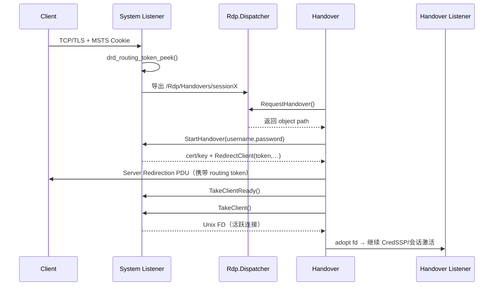

> 当前阶段刻意跳过 PAM 单点登录：system/handover 仍沿用“客户端输入凭据 → CredSSP/NLA”链路，待 lightdm/DSR 暴露统一 API 后再在 `drd_system_daemon_on_get_system_credentials()` 中返回真实凭据，以支持桌面级 SSO。

> 更完整的远程登录/Server Redirection 时序、二次 handover 细节，请参考仓库根目录的《02-远程登录实现流程与机制.md》。

- **DBus 服务配置**：系统模式在启动时通过 `g_bus_own_name_on_connection()` 抢占 `org.deepin.RemoteDesktop`，并注册 acquired/lost 回调：成功占用时记录日志，若 bus/name 丢失则立即请求主循环退出，交由 systemd 拉起新进程，确保 DBus 状态与监听器保持一致。对应的 policy (`data/org.deepin.RemoteDesktop.conf`) 会安装到 `$(sysconfdir)/dbus-1/system.d/`，只允许 `deepin-remote-desktop` 用户拥有该服务，同时开放 `Rdp.Dispatcher`/`Rdp.Handover` 等接口给默认 context；旧版为了兼容性额外调用 `g_bus_own_name()` 的冗余逻辑已移除。部署时需同步安装 conf，否则 system bus 不会允许占用或导出 handover 对象。
- **部署与安装布局**：`meson install` 默认遵循 `sysconfdir/datadir/prefix`，不直接写死 `/etc`/`/usr`，确保发行版可通过 `-Dprefix` 覆盖安装路径。当前数据/服务文件的落盘策略如下：
  - `data/config.d` 作为模板集合安装到 `${datadir}/deepin-remote-desktop/`（默认 `/usr/share/deepin-remote-desktop/`），保持多会话共享；
  - `certs/` 中的开发证书会整体安装到 `${datadir}/deepin-remote-desktop/certs/`，用于本地测试或重新签发示例证书；
  - `data/11-deepin-remote-desktop-handover` 安装至 `${sysconfdir}/deepin/greeters.d/`（默认 `/etc/deepin/greeters.d/`），供 greeter 阶段自动触发 handover；
  - `deepin-remote-desktop-system.service` 部署到 `systemd_system_unit_dir`（通常 `/usr/lib/systemd/system/`），其余 handover/user unit 则统一进入 `systemd_user_unit_dir`（`/usr/lib/systemd/user/` 等）；
  - 如果打包环境暴露 `pkg-config systemd`，Meson 会自动读取 `systemdsystemunitdir/systemduserunitdir`，否则回退到 `prefix/lib/systemd/{system,user}`，便于 Debian/Fedora 等差异路径共存。
- **Debian 打包流程**：`debian/` 目录使用 debhelper + Meson，`debian/rules` 通过 `meson install -C obj-$(DEB_BUILD_GNU_TYPE)`+`DESTDIR=$(CURDIR)/debian/tmp` 直接驱动安装，`deepin-remote-desktop` 可执行文件由 Meson `install_dir=bindir` 安装，其余 `.install` 文件负责归档 `/usr/share/deepin-remote-desktop`、system/systemd user unit、greeter drop-in 与 DBus policy。这样 `dpkg-buildpackage` 便能一次性收集二进制、配置与服务脚本，发行版无需额外拷贝步骤。

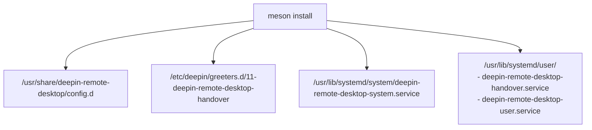

### 7. 通用工具
- `utils/drd_frame`：帧描述对象，封装像素数据/元信息。
- `utils/drd_frame_queue`：线程安全的单帧阻塞队列。
- `utils/drd_encoded_frame`：编码后帧的统一表示，携带 payload 与元数据。

### 8. 虚拟通道与多媒体（规划）
- `channel/rdpdr` 系列：文件重定向、打印机、智能卡等；当前仅保留接口规划，未接入实现。
- `channel/rdpsnd`：音频下行与麦克风回传，预计基于 PulseAudio/PipeWire 适配，后续补充同步策略。
- `channel/clipboard/ime`：剪贴板、Unicode/IME、输入法透传，需结合现有输入层与 GLib 主循环统一调度。

### 9. 服务化与治理（规划）
- systemd/DBus 入口：为桌面环境或守护进程模式提供 handover，确保会话断线后自动恢复监听。
- 观测与策略：指标/trace/日志打点、PAM/LDAP 集成、会话配额与带宽策略；当前仅有基础日志，需逐步补齐。

### 10. 服务重定向管理
- **职责**：串联 system 守护、greeter handover、用户 handover 乃至单点登录过程，确保客户端无感切换 RDP 服务端。
- **机制**：
  - system 模式首次接受连接时注册 `DrdRemoteClient`，随机生成 `routing_token` 并导出对应的 `Rdp.Handover` DBus 对象，等待 handover 进程领取。
  - greeter/用户 handover 在 `RequestHandover` → `StartHandover` 中获取 object path 与一次性凭据，system 守护将 routing token/临时密码封装进 Server Redirection PDU，驱动客户端自动重连。
  - system 在捕获携带既有 token 的二次连接时，直接通过 `TakeClientReady`/`TakeClient` 将 socket fd 转交 handover，整个过程不会重复握手。
- 单点登录（PAM SSO）沿用相同链路，只是 `StartHandover` 下发的凭据来自 pam_sso 管道，handover 进程在接管 FD 后立即注入 PAM 会话，无需客户端再次输入。

### 11. 远程会话管理
- `routing_token`、`client_id` 与 `session_id` 三元组确保一次远程登录能跨 greeter→用户→断线重入保持一致。
- handover session（system DBus 对象）和 remote session（LightDM RemoteDisplayFactory 对象）一一匹配，属性变更信号驱动 session 迁移：
  - 首次登录：client_id 保持不变，session_id 随 LightDM open session 更新；system 监听 signal 后刷新对应 handover session。
  - 复用已存在会话：session_id 不变，client_id 被 greeter 替换；system 监听 `ClientIdChanged` 并广播 `RestartHandover`，handover 重新发送 Redirect。
- `DrdRemoteClient` 记录 `assigned`/`handover_count`，同一路径可复用 object path，支持多段 handover 阶段化处理。

### 12. 远程会话权限控制
- 统一通过 polkit `pkla` 与 `rules` 覆盖策略：远程会话默认视为非本地 seat，需要显式授权才能执行敏感操作。
- SeatRDP 设置 `XDG_SEAT=` 空值 + `DEEPIN_REMOTE_SESSION=TRUE`，配合 polkitd 的 seat 检测逻辑，确保授权策略可区分本地/远程。
- DBus 控制接口与任务栏/控制中心均走 polkit 授权，避免 UI 进程绕过系统策略。

### 13. 配置与隐私管理
- 配置采用 INI + drop-in（`/usr/share/deepin-remote-desktop/config.d` → `/etc/deepin-remote-desktop/config.d` → `~/.local/share/...`）三层覆盖，CLI 选项可即时覆盖 `port`、`TLS`、`encoder`、`NLA`、`runtime_mode`。
- 敏感字段（NLA 密码、PAM 凭据）仅在内存保留，日志使用 `**` 掩码；handover 仅接触一次性凭据，不落盘真实账号。
- 控制中心通过 DBus 下发配置时也遵循上述优先级，`DrdConfig` 在解析后立即合并 TLS 路径并确保只实例化一次。

### 14. 进程管理
- `drd-user`：systemd user service，在 `graphical-session-pre.target` 启动，负责桌面共享，断线时保持运行。
- `drd-system`：systemd system service，运行身份 `deepin-remote-desktop`，监听远程登录端口，并暴露 DBus Dispatcher。
- `drd-handover`：greeter 阶段通过 `/etc/deepin/greeters.d/11-deepin-remote-desktop-handover` 脚本启动，用户会话阶段由 systemd user service 按需拉起。Server Redirection 成功后通常退出，避免占用资源。

### 15. 虚拟屏幕与 DISPLAY 管理
- LightDM 通过 `xserver-xorg-video-dummy` 创建虚拟屏幕，`Section "Screen"` 中可配置分辨率/刷新率，默认 DISPLAY 起始值为 `:100`，防止与本地图形会话冲突。
- handover/user 进程会读取该 DISPLAY，启动捕获/输入链路前设置相同变量，实现“远程登录 = 虚拟席位”。
- 虚拟屏幕卸载由 LightDM seat 管理，hand-over 退出后 DISPLAY 会被回收。

### 16. RDP Seat 管理
- SeatRDP 扩展 LightDM，在 `setup()` 中创建 remote seat，`create_display_server()` 配置 dummy X server，`create_session()` 为 greeter 与用户会话设置 `DEEPIN_REMOTE_SESSION=TRUE` 与空 seat。
- `RequestHandover`/`CreateSingleLogonSession` 接口在 SeatRDP 内实现，与 system 守护的 DBus API 打通，确保 lightdm 知晓 handover session 的 client_id 与 session_id。
- 通过环境变量与 `udisks/polkit` 兼容策略，阻止远程会话直接访问本地硬件。

### 17. UI 模块管理
- 控制中心、任务栏等 UI 组件通过 DBus 读取 `org.deepin.RemoteDesktop.Rdp.Server` 属性，展示端口/TLS 指纹/是否 ViewOnly。
- 远程登录场景下可引导用户启停 systemd service、轮换证书或查看路由 token 状态；桌面共享时可在任务栏提示当前连接并允许断开。
- UI 会根据 `DEEPIN_REMOTE_SESSION` 判断是否隐藏特定功能（如本地显示设置），避免远程 session 误操作。

## 关键接口

### CLI 与配置文件
- 所有模式共享一套 CLI 选项；与 `doc/概要设计.typ` 一致，重要参数如下：

```shell
deepin-remote-desktop \
  -p, --port=PORT             # 默认 3390，可在 system/user/handover 间复用
  --cert=FILE                 # TLS 证书 PEM
  --key=FILE                  # TLS 私钥 PEM
  -c, --config=FILE           # INI 配置路径
  --encoder=MODE              # raw|rfx
  --nla-username=USER         # 静态 NLA 账号
  --nla-password=PASS         # 静态 NLA 密码
  --enable-nla|--disable-nla  # 强制开关 NLA
  --mode=MODE                 # user|system|handover
```

- 完整配置示例（位于 `config.d`）：

```ini
[server]
port=3389

[tls]
certificate=/usr/share/deepin-remote-desktop/certs/server.crt
private_key=/usr/share/deepin-remote-desktop/certs/server.key

[encoding]
mode=rfx
enable_diff=true

[auth]
username=uos
password=1
enable_nla=true
pam_service=deepin-remote-sso

[service]
runtime_mode=handover
rdp_sso=false
```

### LightDM RemoteDisplayFactory
- LightDM 侧通过 `org.deepin.DisplayManager.RemoteDisplayFactory` 创建远程 greeter/SSO 会话，并将 client_id/尺寸/地址透传给 system daemon：

```xml
<node>
  <interface name="org.deepin.DisplayManager.RemoteDisplayFactory.Session">
    <property name="UserName" type="s" access="read"/>
    <property name="Address" type="s" access="read"/>
  </interface>
  <interface name="org.deepin.DisplayManager.RemoteDisplayFactory">
    <method name="CreateRemoteGreeterDisplay">
      <arg name="client_id" direction="in" type="u"/>
      <arg name="width" direction="in" type="u"/>
      <arg name="height" direction="in" type="u"/>
      <arg name="address" direction="in" type="s"/>
      <arg name="session_path" direction="out" type="o"/>
    </method>
    <method name="CreateSingleLogonSession">
      <annotation name="org.gtk.GDBus.C.UnixFD" value="true" />
      <arg name="client_id" direction="in" type="y"/>
      <arg name="width" direction="in" type="u"/>
      <arg name="height" direction="in" type="u"/>
      <arg name="pipe_fd" direction="in" type="h"/>
      <arg name="address" direction="in" type="s"/>
      <arg name="session_path" direction="out" type="o"/>
    </method>
  </interface>
</node>
```

### org.deepin.RemoteDesktop DBus
- system 守护导出 `org.deepin.RemoteDesktop.Rdp.Server/Dispatcher/Handover`，接口定义如下：

```xml
<node>
  <interface name="org.deepin.RemoteDesktop.Rdp.Server">
    <property name="Enabled" type="b" access="read" />
    <property name="Port" type="i" access="read" />
    <property name="TlsCert" type="s" access="read" />
    <property name="TlsFingerprint" type="s" access="read" />
    <property name="TlsKey" type="s" access="read" />
    <property name="ViewOnly" type="b" access="read" />
  </interface>
  <interface name="org.deepin.RemoteDesktop.Rdp.Dispatcher">
    <method name="RequestHandover">
      <arg name="handover" direction="out" type="o" />
    </method>
  </interface>
  <interface name="org.deepin.RemoteDesktop.Rdp.Handover">
    <method name="StartHandover">
      <arg name="username" direction="in" type="s" />
      <arg name="password" direction="in" type="s" />
      <arg name="certificate" direction="out" type="s" />
      <arg name="key" direction="out" type="s" />
    </method>
    <signal name="RedirectClient">
      <arg name="routing_token" type="s" />
      <arg name="username" type="s" />
      <arg name="password" type="s" />
    </signal>
    <signal name="TakeClientReady">
      <arg name="use_system_credentials" type="b" />
    </signal>
    <method name="TakeClient">
      <annotation name="org.gtk.GDBus.C.UnixFD" value="true" />
      <arg name="fd" direction="out" type="h" />
    </method>
    <signal name="RestartHandover" />
  </interface>
</node>
```

## 数据流简述
1. 应用启动后创建 `DrdServerRuntime`，合并配置与 TLS 凭据，调用 `drd_server_runtime_set_encoding_options()` 写入分辨率/编码模式，但不会立即启动 capture/input/encoder。
2. 客户端完成 TLS/NLA→RDP 握手并触发 `DrdRdpSession::Activate` 后，session 会读取 runtime 中缓存的 `DrdEncodingOptions`，再调用 `prepare_stream()` 依次启动 capture/input/encoder；当所有 session 关闭时，`drd_rdp_listener_session_closed()` 会调 `drd_server_runtime_stop()` 停止 `drd_x11_capture_thread`。
3. Renderer 线程通过 `drd_server_runtime_pull_encoded_frame()` 同步等待帧并即时编码：若 Graphics Pipeline 就绪则走 Progressive（成功后将 runtime transport 设为 `DRD_FRAME_TRANSPORT_GRAPHICS_PIPELINE`），否则通过 `SurfaceBits` + `SurfaceFrameMarker` 推送，Raw 帧按行拆分以满足多片段上限。`drd_rdp_session_pump()` 仅在 renderer 尚未启动时退化为 SurfaceBits 发送。

## 关键流程

### 桌面共享（user 模式）
- user 模式直接运行在当前桌面会话，监听端口但仅写入编码参数；真正的 capture/input/encoder 启动被延迟到 `DrdRdpSession::Activate`，确保只有在 TLS/NLA/RDP 握手成功且客户端准备接收画面时才拉起 `drd_x11_capture_thread`。
- TLS+NLA 默认开启，也可针对桌面共享服务配置 view-only 模式。
- 当所有会话关闭后，由监听器回调触发 `drd_server_runtime_stop()`，`drd_x11_capture_thread` 与编码状态即时释放，再次连接会在下一次 Activate 时重新准备；systemd user service 只在显式禁用时退出。

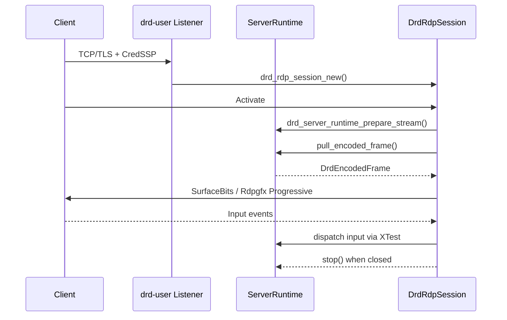

#### 流启动/停止时序
- `DrdRdpSession::Activate` 只有在握手成功后才会调用 `prepare_stream()`，避免 handover/user 进程在无客户端时耗费资源。
- `drd_rdp_listener_session_closed()` 仅在所有 session 释放后才触发 `stop()`，从而停止 `drd_x11_capture_thread` 并清空编码状态，确保重新连接会重新准备链路。

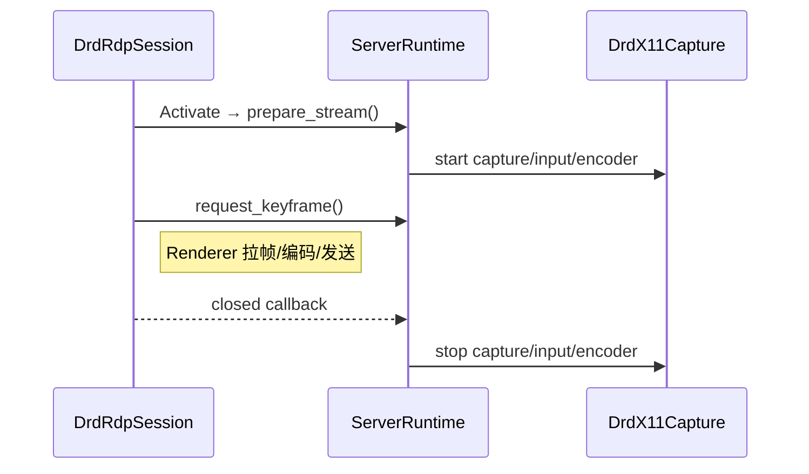

#### 传输模式与 SurfaceBits 回退
- `drd_server_runtime_set_transport()` 由 `GMutex` 切换为原子 CAS：只有真正完成模式切换的线程才会调用 `drd_encoding_manager_force_keyframe()`，避免渲染与事件线程在切换 SurfaceBits/Rdpgfx 时互相阻塞。
- `DrdRdpSession` 激活后会缓存 `FreeRDP_MultifragMaxRequestSize`，渲染线程只需读取原子值即可得知 SurfaceBits 的 payload 限制；若缓存缺失，再次访问 FreeRDP settings 后写回缓存。
- SurfaceBits 退回改用 `DRD_LOG_DEBUG`，仅在图形管线不可用时输出一行“fallback + limit”日志，避免逐帧刷屏；同时行分片逻辑继续遵守协商的 payload 上限。

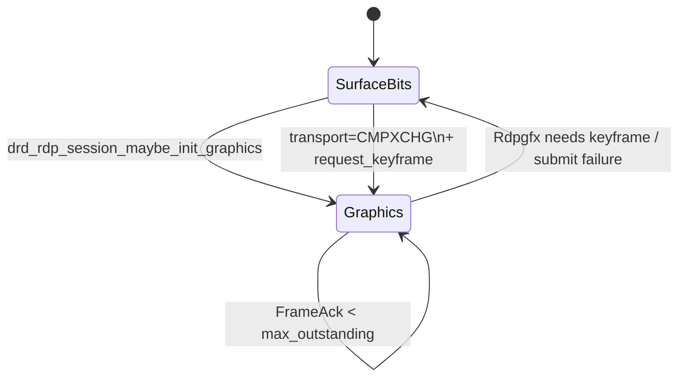

### 远程 Greeter 登录
- system 监听端口 → 生成 client_id/routing_token → 导出 handover session。
- LightDM RemoteDisplayFactory 创建 remote session，greeter handover 请求 handover 对象并发起 `StartHandover`，system 发送 Server Redirection，客户端携带 routing token 重连。
- system 匹配 token 后通知 greeter handover `TakeClientReady`，handover 抢占 fd、完成握手并推流虚拟屏幕。
- 用户输入凭据后，LightDM open session，session_id 更新，system 监听 signal，等待下一阶段 handover。
- System daemon 现在可通过 `drd_system_daemon_get_pending_client_count()` / `get_remote_client_count()` 获取当前排队的 handover 数和总注册客户端数，日志会在新客户端注册时输出这两个指标，便于后续限流和监控。

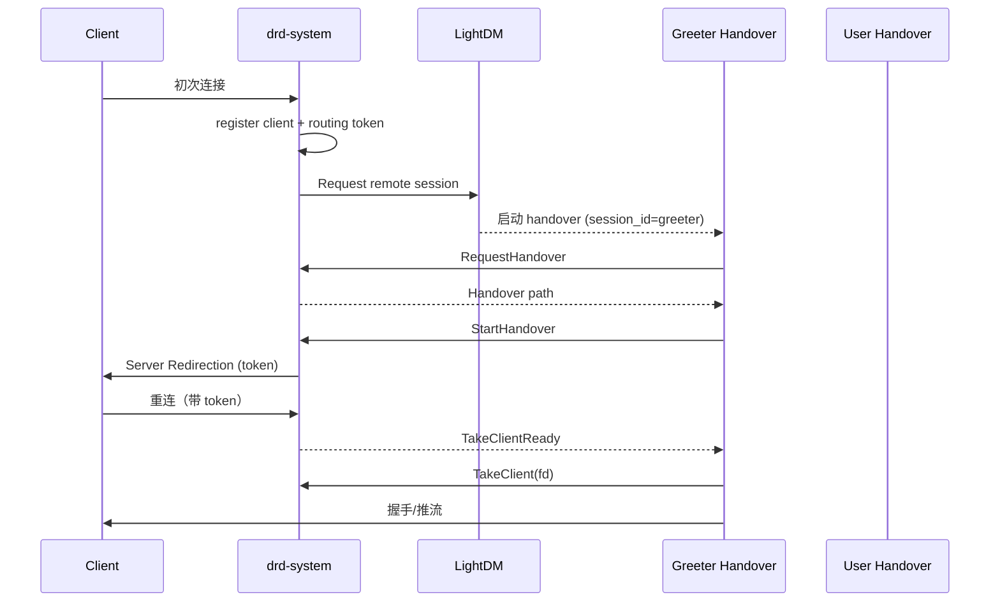

### 远程单点登录（TLS+PAM）
- system 接受连接后读取 Client Info 用户名/密码，将凭据写入 PAM pipe，通过 `CreateSingleLogonSession` 通知 LightDM。
- handover `RequestHandover` → `StartHandover` 后直接接收 pam_sso 下发的一次性凭据，客户端在第二次 CredSSP 时复用同一 TLS 身份。
- handover 在 `TakeClient` 后立即调用 PAM，成功后启动 renderer 线程。

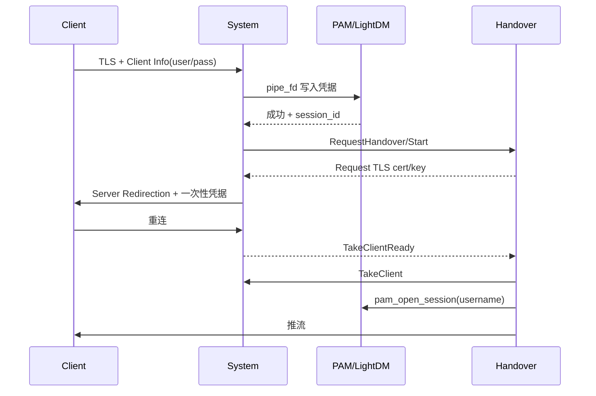

### 复用已有远程会话
- **Greeter 重进现有会话**：若 LightDM 检测到用户已有 session，不再 `open_session`；而是将新的 greeter remote session 的 client_id 写回旧会话，system 监听到 attribute 变化后向 handover 发 `RestartHandover`，原 handover 发送 Redirect 并退出，客户端重连后被用户 handover 接管。
- **远程单点登录重进**：LightDM 在校验凭据后直接更新已有 remote session 的 client_id，system 同样触发 `RestartHandover` → Redirect → TakeClientReady 流程，整个过程 session_id 保持不变。
- 这两条路径都依赖 routing token → client_id 的互逆关系，确保任何阶段都能找到唯一 handover session。

## 现代 RDP 功能蓝图
- **显示链路**：现状为 X11 抓屏 + RFX/Raw；规划 H.264/AVC444、硬件加速、频道自适应（RFX↔H.264）与多显示器/DisplayControl。
- **输入与协作**：现状具备键鼠；规划 Unicode/IME、Clipboard VCHANNEL、触控/笔、快捷键修复。
- **多媒体与设备**：待补充 rdpsnd（音频播放/录制）与 rdpdr（文件、打印机、智能卡、USB 转发）。
- **网络与治理**：需引入带宽/丢包探测、自适应码率、故障恢复、systemd handover 与健康探针。
- **安全**：保持 TLS + NLA 默认开启，后续接入密钥托管、凭据轮换、多因子/外部认证接口。

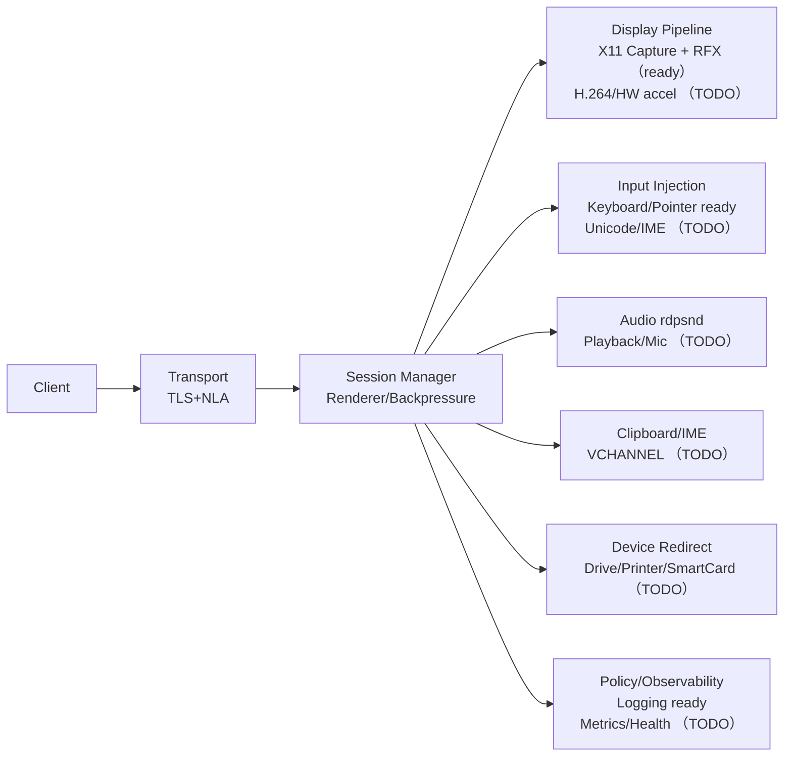

## 安全链路（TLS + NLA）
- `[auth] enable_nla=true`（默认）：沿用 SAM 文件策略，`DrdRdpListener` 读取 `[auth] username/password` 并调用 `drd_nla_sam_file_new()` 写入一次性数据库，FreeRDP 仅接受提前配置的帐密；CredSSP 完成后 SAM 立刻删除。
- `[auth] enable_nla=false` + `--system`：禁用 NLA，监听器在 TLS-only 模式下读取 Client Info 的用户名/密码并交给 `security/drd_local_session` 走 PAM，完成“客户端凭据 → PAM 会话”的一次输入体验。
- 无论哪种模式，都强制关闭纯 RDP Security（`RdpSecurity=FALSE`），要么使用 CredSSP（NLA），要么使用 TLS-only + PAM，避免降级导致凭据泄露。

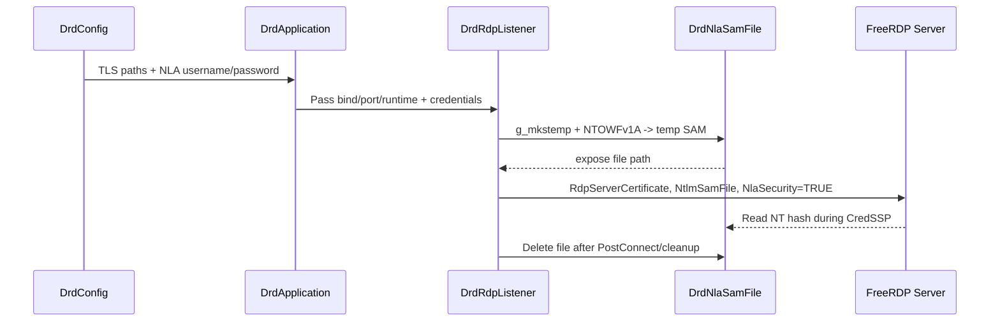

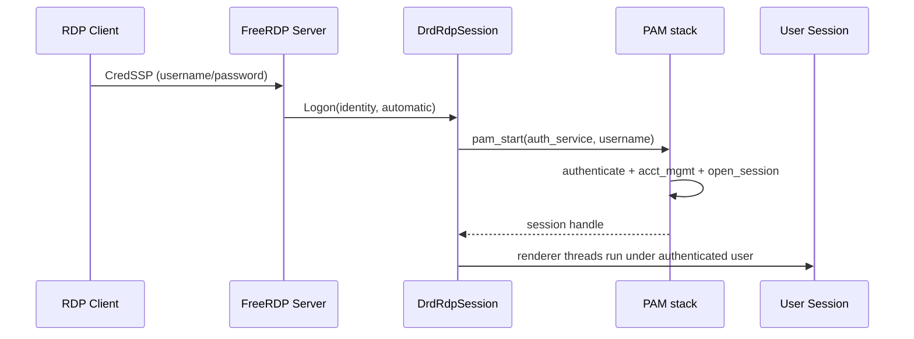

## System 模式与 systemd 托管
- `--system` 仅允许 root 启动（建议通过 systemd 管理），在 `[auth] enable_nla=false` 时默认使用 `deepin-remote-desktop-system` PAM service，且不启动采集/编码线程。
- PAM 会话由 `security/drd_local_session` 负责创建/关闭，服务退出或连接断开时调用 `pam_close_session + pam_setcred(PAM_DELETE_CRED)` 擦除凭据。
- 在该模式下不会初始化 X11 捕获/编码/输入线程，会话激活后仅保留 TLS/NLA 握手与 PAM 登录流程，不再尝试推流；当 `[auth] enable_nla=false`（或 CLI `--disable-nla`）时，监听器降级为 TLS-only RDP Security Layer，直接读取 Client Info 中的用户名/密码并交给 PAM，实现“无 NLA 的单点登录”。
- `config/deepin-remote-desktop.service` 提供最小化的 unit 示例：`ExecStart=/usr/bin/deepin-remote-desktop --system --config /etc/deepin-remote-desktop.ini`，并启用 `NoNewPrivileges/ProtectSystem/PrivateTmp` 等加固选项。
- 部署步骤：`cp config/deepin-remote-desktop.service /etc/systemd/system/` → 根据环境调整路径 → `systemctl enable --now deepin-remote-desktop`，systemd 负责重启和日志采集。

## RDP 分辨率同步策略
- 运行时负责维护最新的 `DrdEncodingOptions`，监听器在 `freerdp_peer` 初始化时根据该选项写入 `FreeRDP_DesktopWidth/Height`、RemoteFX 能力并禁用 DisplayControl/MonitorLayout，以静态分辨率保障为主。
- 监听器挂接 `client->Capabilities` 回调，若客户端在 Capability 交换中未声明 `DesktopResize`，立即拒绝连接并提示客户端当前分辨率，避免进入激活态后才发现冲突。
- 会话在 `Activate` 阶段调用 `drd_rdp_session_enforce_peer_desktop_size()`，再次读取编码宽高并回写到 `rdpSettings`，若发现客户端偏离则立即触发一次 `DesktopResize`。
- 若客户端未在 Capability 阶段声明 `DesktopResize` 支持且仍坚持非服务器分辨率，会话直接拒绝激活并记录告警，防止无限重连；只有在 FreeRDP 回调链提供 `DesktopResize` 时才执行强制回写。
- 通过上述多级同步，Remmina/FreeRDP 新版本即便尝试窗口缩放也会被强制回调至服务器实际桌面尺寸，帧推流始终匹配编码几何，避免 `Invalid surface bits`。


## glib-rewrite RDPGFX 初始化与锁策略
- `drd_rdp_session_vcm_thread` 轮询 FreeRDP 事件，监听 `DRDYNVC_STATE_READY` 后唤起 `drd_rdp_graphics_pipeline_maybe_init()` 完成 Rdpgfx 管线初始化。
- 初始化流程必须在调用 `rdpgfx_context->Open()` 前释放 `DrdRdpGraphicsPipeline::lock`，因为 FreeRDP 会在 `Open()` 过程中同步触发 `ChannelIdAssigned`/`CapsAdvertise` 回调，而这些回调同样会再次进入管线对象并尝试获取同一把锁。
- 只有在 `caps_confirmed` 置位后，才能调用 `ResetGraphics`/`CreateSurface`/`MapSurfaceToOutput` 来准备 RFX Progressive Surface；否则应继续等待 VCM 回调驱动能力协商。

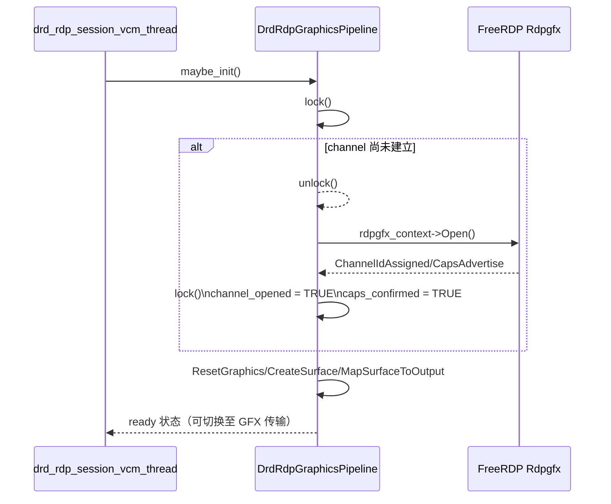

## Progressive RFX 帧封装
- `DrdRfxEncoder` 新增 `drd_rfx_encoder_write_progressive_message()`（`glib-rewrite/src/encoding/drd_rfx_encoder.c:218-379`），按 [MS-RDPEGFX] 规范依次写入 `SYNC`、`CONTEXT`、`FRAME_BEGIN/REGION/TILE/FRAME_END`，确保 Windows 客户端能正确解码。
- FreeRDP 提供的 `progressive_rfx_write_message_progressive_simple()` 仅生成精简流，缺少 `RFX_PROGRESSIVE_CONTEXT`/`REGION` 元数据，导致客户端侧色彩错位；因此编码器改为显式构建 Header 并追踪 `progressive_header_sent` 状态（`glib-rewrite/src/encoding/drd_rfx_encoder.c:404-414`）。
- 为了在强制关键帧或重新配置后刷新上下文，每次触发 `drd_rfx_encoder_force_keyframe()` 都会复位 Header 标记，保证下一帧重新携带同步块（`glib-rewrite/src/encoding/drd_rfx_encoder.c:623-628`）。
- Progressive 帧提交路径增加了 `needs_keyframe` 守卫：`drd_rdp_graphics_pipeline_submit_frame()` 会拒绝在尚未发送关键帧时提交增量帧，并通过新的 `DRD_RDP_GRAPHICS_PIPELINE_ERROR_NEEDS_KEYFRAME` 错误提示会话调用 `drd_server_runtime_request_keyframe()`，防止客户端收到缺失 Progressive Header 的数据（`glib-rewrite/src/session/drd_rdp_graphics_pipeline.c`、`drd_rdp_session.c`）。关键帧标记在会话层读取后随参数传入，避免编码线程重用同一 `DrdEncodedFrame` 对象时造成竞态。
- Progressive 路径默认切换到 `RLGR1`，保持与 `gnome-remote-desktop` 及 Windows mstsc 的兼容性；SurfaceBits 仍可沿用 `RLGR3` 以追求更高压缩率。若需要调试全量帧，可在 `[encoding] enable_diff=false` 或调用 `drd_server_runtime_request_keyframe()`。

## 单线程编码与发送
- `DrdServerRuntime` 不再维护独立的编码线程 / `encoded_queue`。`drd_server_runtime_pull_encoded_frame()` 会直接从 `DrdCaptureManager` 取出最新 `DrdFrame`，立刻调用 `DrdEncodingManager` 同步编码并将 `DrdEncodedFrame` 返回给会话线程（`glib-rewrite/src/core/drd_server_runtime.c:146-191`）。
- 每个会话在 `Activate` 后都会启动专用 renderer 线程（`drd_rdp_session_render_thread()`，`glib-rewrite/src/session/drd_rdp_session.c:800+`）。该线程串行执行 “等待 capture 帧 → 编码 → Rdpgfx 提交 / SurfaceBits 回退”，与 GNOME 的 graphics 线程一致，同时释放 GLib 主循环。
- `drd_rdp_session_pump()` 仅在 renderer 尚未启动时工作（例如激活前），避免重复发送；帧序号仍由 session 维护，renderer 线程结束后自动释放引用。
- 传输模式切换（SurfaceBits ↔ Progressive）仅更新 `transport_mode` 并强制下一帧关键帧，不再需要清空编码队列；renderer 会等待下一帧并立即产出关键帧，方便调试完整画面。

## FrameAcknowledge 与 Rdpgfx 背压
- `DrdRdpGraphicsPipeline` 维护 `outstanding_frames`/`max_outstanding_frames` 与 `capacity_cond`；renderer 线程在调用 `drd_rdp_graphics_pipeline_wait_for_capacity()` 时会在 `capacity_cond` 上阻塞，直至 `FrameAcknowledge` 或提交失败唤醒，确保“客户端确认一帧→服务器再发送下一帧”。
- 客户端发送的 `RDPGFX_FRAME_ACKNOWLEDGE_PDU`（`frameId`、`totalFramesDecoded`、`queueDepth`）在 `drd_rdpgfx_frame_ack()` 中被消费：当前实现仅将 `outstanding_frames` 减 1 并广播 `capacity_cond`，尚未读取 `queueDepth` 进一步调节速率，背压主要依靠 `max_outstanding_frames`。
- 如果在超时时间内一直得不到 ACK，会话会调用 `drd_rdp_session_disable_graphics_pipeline()` 回退 SurfaceBits，并通过 `drd_server_runtime_request_keyframe()` 在恢复时强制全量帧，保证客户端状态重新对齐。

## Renderer & Capture 线程协作
- **捕获线程**：`drd_x11_capture_thread()` 监听 XDamage 事件，将像素写入 `DrdFrameQueue` 环形缓冲（当前容量 3 帧，超限会丢弃最旧帧并记录计数），renderer 线程消费时仍能尽量拿到最新的画面，同时可根据丢帧指标判断是否存在背压；`damage_pending` 会在帧间隔内合并多个 XDamage，统一按 `target_interval`（默认 24fps）抓帧，避免事件驱动推高帧率。
- **Renderer 线程**：`drd_rdp_session_render_thread()` 在 `render_running` 标志下循环：等待 Rdpgfx 容量 → 调用 `drd_server_runtime_pull_encoded_frame()`（同步等待并编码）→ 优先提交 Progressive，失败则退回 SurfaceBits；过程中持续维护 `frame_sequence`、关键帧状态和 `needs_keyframe` 标志，且无需额外 `DrdRdpRenderer` 模块。
- **生命周期**：renderer 线程在会话 `Activate` 时启动，`drd_rdp_session_stop_event_thread()`/`drd_rdp_session_disable_graphics_pipeline()` 会在断开或切换时停止线程并重置状态，确保 capture/renderer 不会引用失效的 `freerdp_peer`。

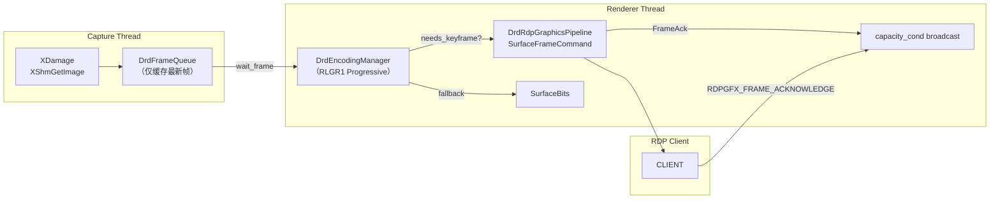

## Rdpgfx 背压与关键帧修复（2025-11-12）
- `DrdRdpGraphicsPipeline` 新增 `capacity_cond` 条件变量，`FrameAcknowledge` 以及提交失败都会唤醒等待者，`drd_rdp_graphics_pipeline_wait_for_capacity()` 允许在握有同一把锁的情况下等待 “未确认帧 `< max_outstanding_frames`” 的判定（`glib-rewrite/src/session/drd_rdp_graphics_pipeline.c:24-116`、`:264-333`、`:389-452`）。
- 会话渲染逻辑直接内嵌在 `drd_rdp_session_render_thread()`（`glib-rewrite/src/session/drd_rdp_session.c`）中：线程串行调用 `drd_rdp_graphics_pipeline_submit_frame()`，失败时立即请求关键帧或降级，无需单独 `DrdRdpRenderer` 模块。
- `drd_rdp_session_try_submit_graphics()` 在提交 Progressive 帧前若检测到拥塞，会调用 `drd_rdp_graphics_pipeline_wait_for_capacity()` 并一直阻塞直到 ACK/管线重置释放槽位；若等待返回仍无法提交，则禁用 Rdpgfx 回退 SurfaceBits，同时强制关键帧，避免客户端长时间灰屏。
- 通过 renderer + 条件变量，rdpgfx 在正常情况下不会直接丢帧；当客户端未发送 ACK 时，系统会自动降级并刷新关键帧，确保画面尽快恢复。

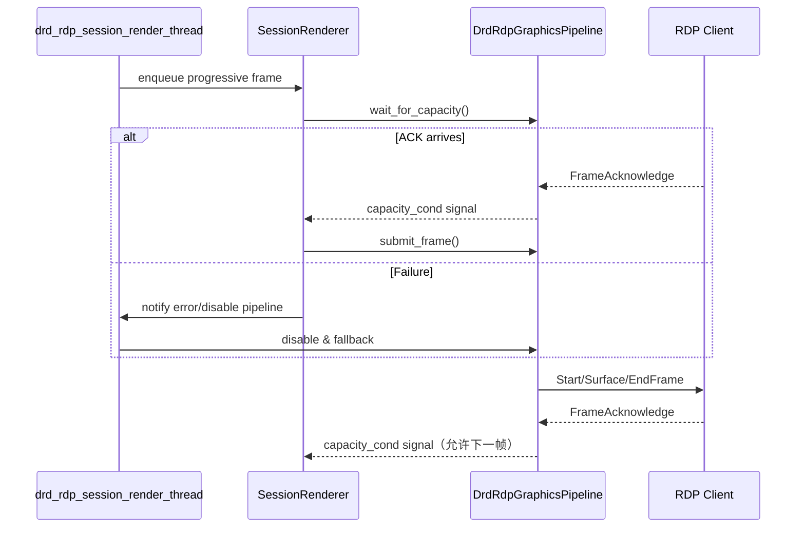

## 会话生命周期与重连（2025-11-14）
- `DrdRdpPeerContext` 现在持有 `DrdRdpListener *listener`，当 FreeRDP 触发 `Disconnect` 或上下文析构时能够回调监听器，保持单一职责：会话对象仍聚焦图像/输入流，而连接资源释放由监听器集中处理。
- `drd_rdp_listener_session_closed()` 负责从 `sessions` 数组中移除断线的 `DrdRdpSession`，只有当真正找到了匹配项才输出日志并减少引用计数，避免重复移除造成的未定义行为。
- `drd_peer_disconnected()` 与 `drd_peer_context_free()` 都会调用该方法，从而覆盖正常断线与握手失败两条路径，确保 `sessions->len` 回落到 0，新的客户端即可重新接入，不再出现 “session already active”。
- `DrdRdpSession` 在 VCM 线程退出或 `drd_rdp_session_stop_event_thread()` 完成时会触发一次性关闭回调，由监听器在主线程内同步移除 `sessions` 元素，即使 FreeRDP 未调用 `client->Disconnect` 也不会遗留僵尸会话。
- 由于监听器自己的生命周期仍由 `DrdApplication` 管控，不需要在移除会话时立即 `stop()` runtime，避免下一次连接时缺少捕获/编码链路。

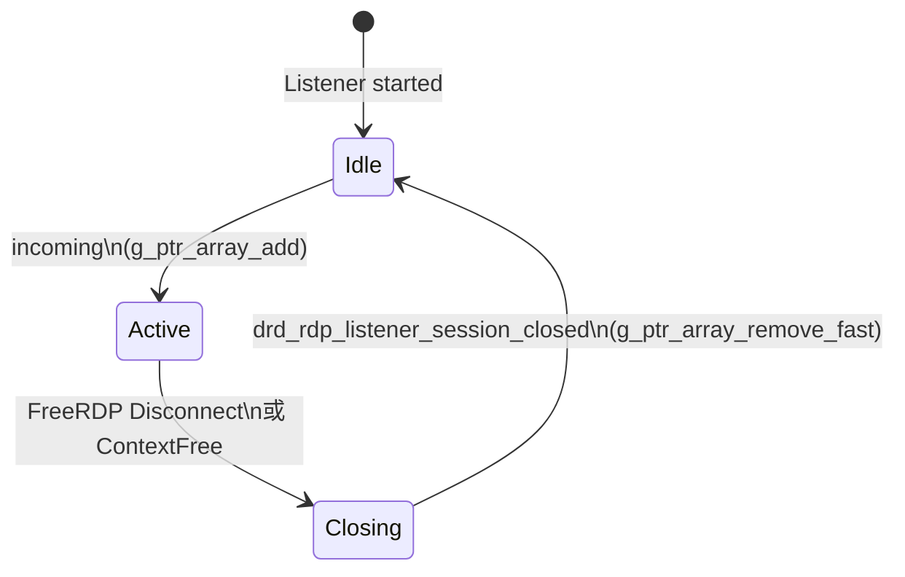

## 短期待优化（已落地功能）
- **Rdpgfx 失联超时**：`drd_rdp_session_try_submit_graphics()` 仍以无限等待 ACK 为主，需要补充分级超时/自动降级策略，避免 renderer 阻塞。
- **输入兼容性**：`drd_x11_input_inject_unicode()` 空置，Alt/组合键在部分客户端不可用；需补齐 UTF-16 → Keysym 映射与快捷键测试。
- **多显示器/分辨率**：`drd_rdp_graphics_pipeline_reset_locked()` 发送 `monitorCount=0`，缺失拓扑信息；需要在 DisplayControl 关闭时仍回传物理显示布局。

## 能力缺口（现代 RDP 必备）
- **多媒体**：rdpsnd 音频播放/录制尚未集成；后续需与编码帧同步、处理采样率与缓冲策略。
- **协作通道**：剪贴板、IME/Unicode 输入、触控/笔事件缺失，影响日常办公体验。
- **视频编码**：H.264/AVC444 与硬件加速未落地，带宽自适应与 QoS 机制尚未实现。
- **虚拟设备**：文件/打印机/智能卡/USB 重定向均为空白，需要依次接入 rdpdr 子通道。
- **服务化**：systemd/DBus handover、健康探针、Session 并发与策略控制尚未完成。
- **平台适配**：Wayland 捕获与输入、加密密钥安全存储（如内核密钥环/硬件密钥）仍需规划。
