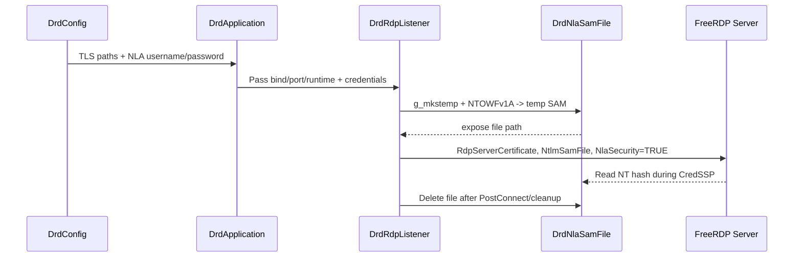

# Deepin Remote Desktop (drd) 架构概览

## 总体目标
- 以 C(GLib/GObject) 为核心，重构原 C++ RDP 服务端，保证单一职责、易扩展。
- 构建模块化层次：应用入口 → 运行时 → 采集/编码/输入 → 传输(RDP) → 对外接口。
- 在重构过程中逐步替换旧逻辑，避免新旧代码交叉依赖。

## 模块分层

### 1. 核心层
- `core/drd_application`：负责命令行解析、GLib 主循环、信号处理与监听器启动，并在 CLI/配置合并后记录生效参数及配置来源，确保 TLS 凭据只实例化一次（打包进 `libdrd-core.a`）。
- `core/drd_server_runtime`：聚合 Capture/Encoding/Input 子系统，提供 `prepare_stream()` / `stop()` 接口，并在内部启动编码线程，从抓屏队列取帧并通过 `GAsyncQueue` 将编码帧传递给会话层；`pull_encoded_frame()` 提供基于超时的阻塞拉取，停服时输出资源回收日志。
- `core/drd_config`：解析 INI/CLI 配置，集中管理绑定地址、TLS 证书、捕获尺寸等运行参数。
- `security/drd_tls_credentials`：加载并缓存 TLS 证书/私钥，供运行时向 FreeRDP Settings 注入。
- `security/drd_nla_sam`：基于用户名/密码生成临时 SAM 文件，写入 `FreeRDP_NtlmSamFile`，允许 CredSSP 在 NLA 期间读取 NT 哈希。

### 2. 采集层
- `capture/drd_capture_manager`：启动/停止屏幕捕获，维护帧队列。
- `capture/drd_x11_capture`：X11/XShm 抓屏线程，侦听 XDamage 并推送帧。
（以上与编码/输入/工具组成 `libdrd-media.a`，供核心库复用）

### 3. 编码层
- `encoding/drd_encoding_manager`：统一编码配置、调度；对外暴露帧编码接口。
- `encoding/drd_raw_encoder`：原始帧编码器（BGRX → bottom-up），兼容旧客户端。
- `encoding/drd_rfx_encoder`：基于 RemoteFX 的压缩实现，支持帧差分与底图缓存，默认使用 RLGR3 以保证压缩率。

### 4. 输入层
- `input/drd_input_dispatcher`：键鼠事件注入入口，管理 X11 注入后端与 FreeRDP 回调。
- `input/drd_x11_input`：基于 XTest 的实际注入实现，负责键盘、鼠标、滚轮事件，并在启动时读取真实桌面分辨率、根据编码流尺寸动态缩放坐标。

### 5. 传输层
- `transport/drd_rdp_listener`：FreeRDP 监听生命周期、Peer 接入、会话轮询，监听器在成功绑定后输出 tick-loop 日志便于诊断。
- `session/drd_rdp_session`：会话状态机，维护 peer + runtime 引用，通过 SurfaceBits 推送编码帧（对 Raw 帧按行分片，避免超限 payload），封装键鼠事件注入入口，并对事件线程生命周期进行显式日志记录。

### 6. 通用工具
- `utils/drd_frame`：帧描述对象，封装像素数据/元信息。
- `utils/drd_frame_queue`：线程安全的单帧阻塞队列。
- `utils/drd_encoded_frame`：编码后帧的统一表示，携带 payload 与元数据。

## 数据流简述
1. 应用启动后创建 `DrdServerRuntime`，准备编码器与采集模块。
2. `DrdCaptureManager` 启动 `DrdX11Capture`，持续推送 `DrdFrame`；运行时编码线程消费该队列并将 `DrdEncodedFrame` 写入异步队列。
3. 会话层从编码队列拉取帧，经 `SurfaceFrameMarker`/`SurfaceBits` 推送给客户端，并在无帧时保持事件响应。

## 安全链路（TLS + NLA）
- `config/default.ini` 及 CLI 新增 `[auth]`/`--nla-{username,password}`，服务进程启动时必须提供 NLA 凭据，才能生成 SAM 文件。
- `DrdRdpListener` 在 `drd_configure_peer_settings()` 阶段串联 TLS 证书与 SAM 文件：一方面走 `drd_tls_credentials_apply()` 注入 PEM，另一方面使用 `drd_nla_sam_file_new()` 生成一次性数据库路径并设置 `FreeRDP_NtlmSamFile`。
- 监听器在设置展示参数后强制 `NlaSecurity=TRUE`、`TlsSecurity=FALSE`、`RdpSecurity=FALSE`，从而锁定 CredSSP，不再回退纯 TLS/RDP。
- SAM 文件在 `PostConnect` 即 CredSSP 完成后立即删除，避免磁盘残留；失败路径由 peer context 析构兜底。

## 设计原则落实
- **SOLID**：各模块限定单一职责；监听器依赖抽象的 runtime；待迁移的编码/输入将通过接口剥离具体实现。
- **KISS/YAGNI**：阶段性仅实现最小可运行路径（监听 + 采集），编码/输入按需延伸。
- **DRY**：帧结构、队列作为共享组件供捕获/编码/传输复用。

## RDP 分辨率同步策略
- 运行时负责维护最新的 `DrdEncodingOptions`，监听器在 `freerdp_peer` 初始化时根据该选项写入 `FreeRDP_DesktopWidth/Height`、RemoteFX 能力并禁用 DisplayControl/MonitorLayout，以静态分辨率保障为主。
- 监听器挂接 `client->Capabilities` 回调，若客户端在 Capability 交换中未声明 `DesktopResize`，立即拒绝连接并提示客户端当前分辨率，避免进入激活态后才发现冲突。
- 会话在 `Activate` 阶段调用 `drd_rdp_session_enforce_peer_desktop_size()`，再次读取编码宽高并回写到 `rdpSettings`，若发现客户端偏离则立即触发一次 `DesktopResize`。
- 若客户端未在 Capability 阶段声明 `DesktopResize` 支持且仍坚持非服务器分辨率，会话直接拒绝激活并记录告警，防止无限重连；只有在 FreeRDP 回调链提供 `DesktopResize` 时才执行强制回写。
- 通过上述多级同步，Remmina/FreeRDP 新版本即便尝试窗口缩放也会被强制回调至服务器实际桌面尺寸，帧推流始终匹配编码几何，避免 `Invalid surface bits`。
