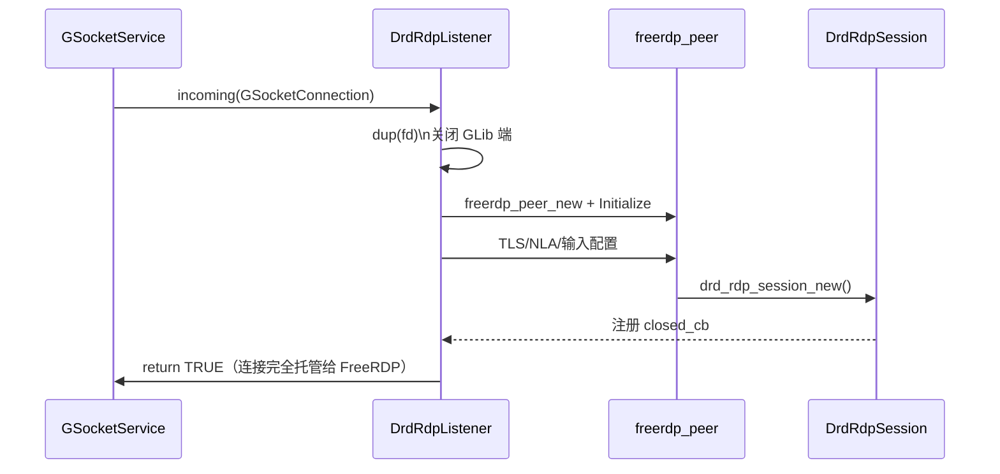
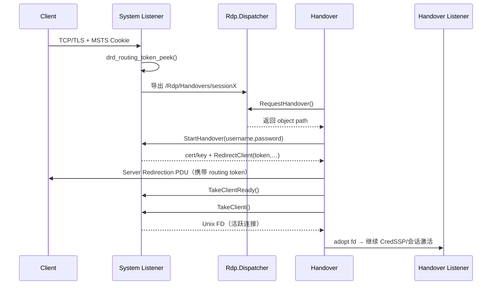
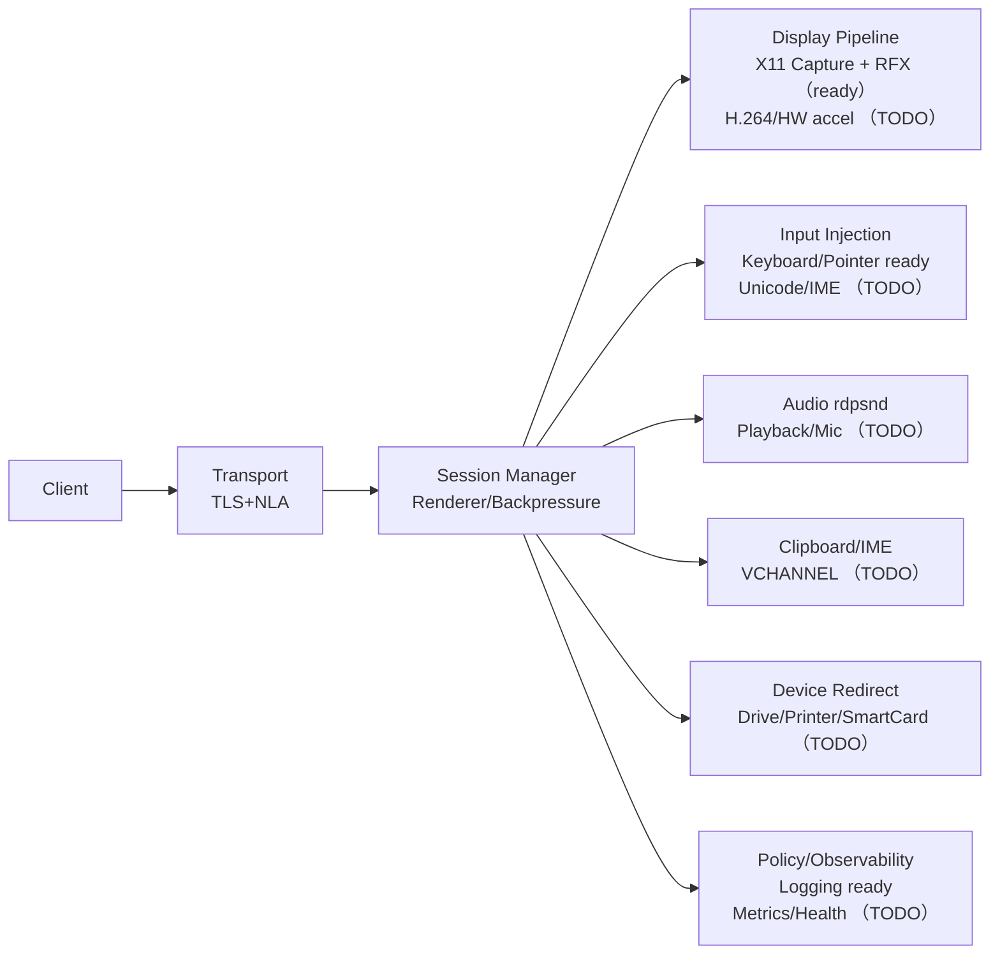
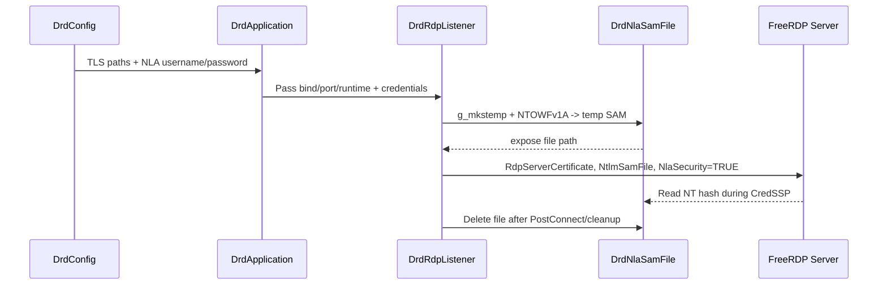
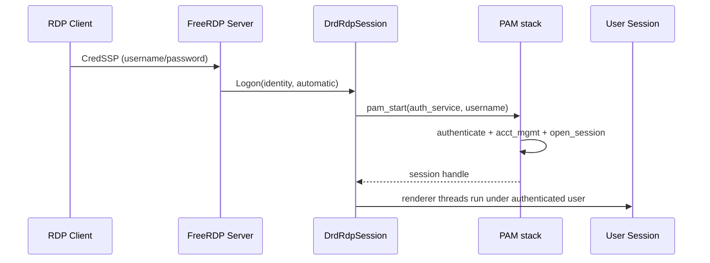
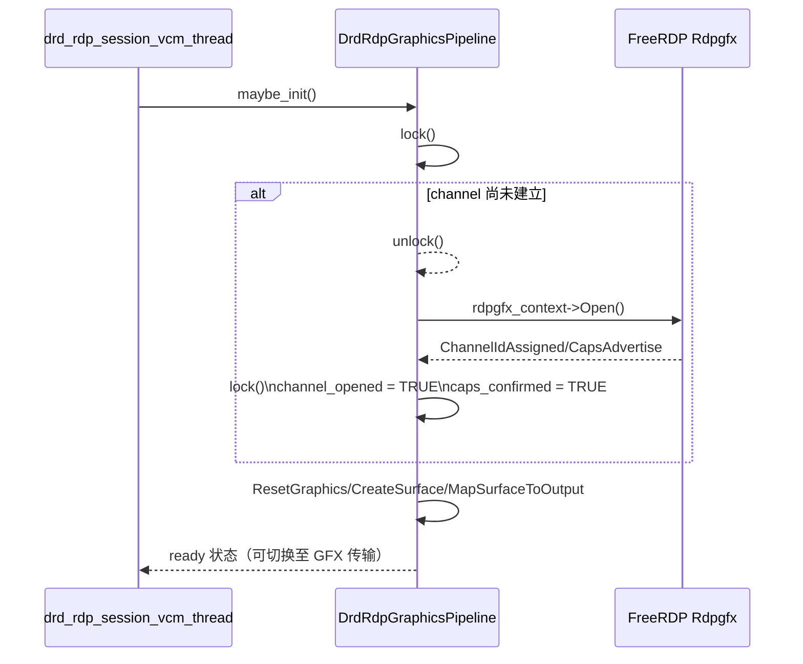
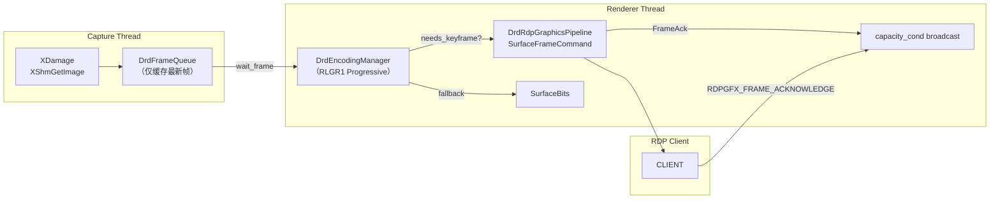
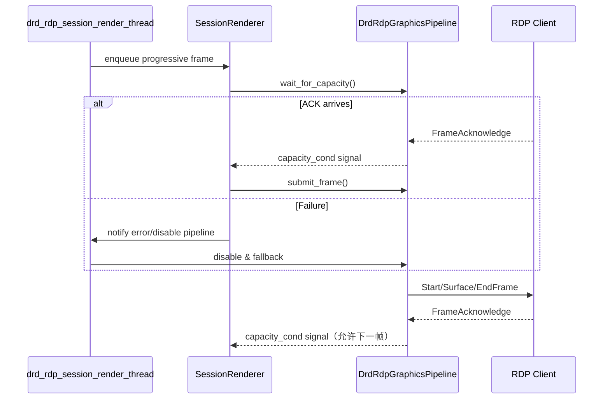
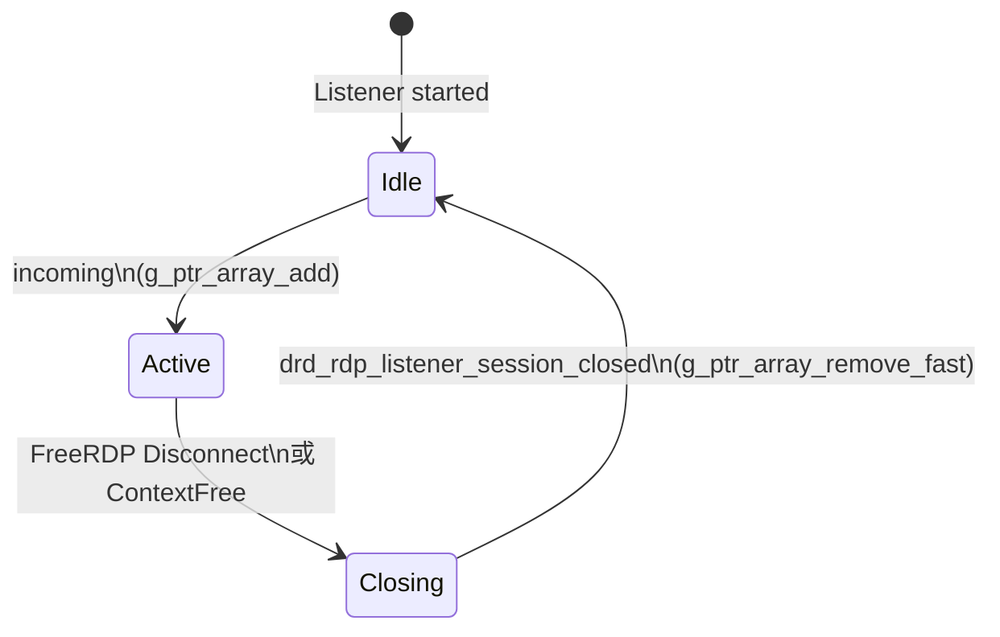

# Deepin Remote Desktop (drd) 架构概览

## 愿景与范围
- 定位为 Linux 上的现代 RDP 服务端，覆盖远程显示/输入、多媒体、虚拟通道、安全接入与服务化运维。
- 以 C(GLib/GObject) + FreeRDP 为主干，保持单一职责、可替换、易调试；按能力分阶段落地，确保每个增量可独立验证。
- 模块化运行时：应用入口 → 配置/安全 → 采集 & 编码 → RDP 传输 → 虚拟通道/设备 → 服务治理（监控、策略、自动化恢复）。

## 当前能力概览
- **显示/编码**：X11/XDamage 抓屏 + 单帧队列，RFX Progressive（默认 RLGR1）与 Raw 回退，关键帧/上下文管理齐备。
- **传输**：FreeRDP 监听 + TLS/NLA 强制，渲染线程串行“等待帧→编码→Rdpgfx/SurfaceBits 发送”，具备 ACK 背压与自动回退逻辑。
- **输入**：XTest 键鼠注入，扩展扫描码拆分，支持指针缩放；Unicode 注入仍未实现。
- **配置/安全**：INI/CLI 合并，TLS 凭据集中加载，NLA SAM 临时文件确保 CredSSP，拒绝回退纯 TLS/RDP。
- **可观测性**：关键路径日志保持英语，文档/计划与源码同步更新，便于跟踪 renderer、Rdpgfx、会话生命周期。

## 模块分层

### 1. 核心层
- `core/drd_application`：负责命令行解析、GLib 主循环、信号处理与监听器启动，并在 CLI/配置合并后记录生效参数及配置来源，确保 TLS 凭据只实例化一次（打包进 `libdrd-core.a`）。
- `core/drd_server_runtime`：聚合 Capture/Encoding/Input 子系统，`prepare_stream()` 配置三者后缓存 `DrdEncodingOptions`，`pull_encoded_frame()` 每次直接从 `DrdCaptureManager` 拉取最新帧并同步调用 `DrdEncodingManager` 编码，`set_transport()` 用于在 SurfaceBits 与 Rdpgfx 之间切换并强制关键帧；内部不再维护独立线程或 `GAsyncQueue`。
- `core/drd_config`：解析 INI/CLI 配置，集中管理绑定地址、TLS 证书、捕获尺寸及 `enable_nla`/`pam_service` 等安全参数。
- `security/drd_tls_credentials`：加载并缓存 TLS 证书/私钥，供运行时向 FreeRDP Settings 注入。
- `security/drd_nla_sam`：基于用户名/密码生成临时 SAM 文件，写入 `FreeRDP_NtlmSamFile`，允许 CredSSP 在 NLA 期间读取 NT 哈希。
- `security/drd_local_session`：在关闭 NLA（TLS+PAM 单点登录）时运行，使用 PAM 完成 `pam_authenticate/pam_open_session`，生成可供 capture/input 复用的本地用户上下文，并负责凭据擦除与 `pam_close_session`。

### 2. 采集层
- `capture/drd_capture_manager`：启动/停止屏幕捕获，维护帧队列。
- `capture/drd_x11_capture`：X11/XShm 抓屏线程，侦听 XDamage 并推送帧。
（以上与编码/输入/工具组成 `libdrd-media.a`，供核心库复用）

### 3. 编码层
- `encoding/drd_encoding_manager`：统一编码配置、调度；对外暴露帧编码接口，并在 Progressive 超出多片段限制时自动回退 RAW。
- `encoding/drd_raw_encoder`：原始帧编码器（BGRX → bottom-up），兼容旧客户端。
- `encoding/drd_rfx_encoder`：基于 RemoteFX 的压缩实现，支持帧差分与底图缓存；Progressive 路径固定使用 RLGR1（`rfx_context_set_mode(RLGR1)`）保持与 mstsc/gnome-remote-desktop 一致，SurfaceBits 仍以 RLGR3 为主。

### 4. 输入层
- `input/drd_input_dispatcher`：键鼠事件注入入口，管理 X11 注入后端与 FreeRDP 回调。
- `input/drd_x11_input`：基于 XTest 的实际注入实现，负责键盘、鼠标、滚轮事件，并在启动时读取真实桌面分辨率、根据编码流尺寸动态缩放坐标；同时在注入键盘事件时会把扩展按键的第 9 位（0xE0）剥离，只向 `freerdp_keyboard_get_x11_keycode_from_rdp_scancode()` 传递 8-bit scan code 与独立的 `extended` 标记，避免方向键等扩展扫描码超出 0–255 范围；若 FreeRDP 的旧映射返回 0（常见于 Alt/AltGr 等修饰键），则退回到 `XKeysymToKeycode()` 基于键值的查找，以确保修饰键必然可注入。

### 5. 传输层
- `transport/drd_rdp_listener`：直接继承 `GSocketService`，通过 `g_socket_listener_add_*` 绑定端口，`incoming` 信号里将 `GSocketConnection` 的 fd 复制给 `freerdp_peer`，再复用既有 TLS/NLA/输入配置流程，整个监听循环交由 GLib 主循环驱动；system 模式会提前挂接 `GCancellable`，后续可扩展 handover/token 逻辑。
- `session/drd_rdp_session`：会话状态机，维护 peer/runtime 引用、虚拟通道、事件线程与 renderer 线程。`drd_rdp_session_render_thread()` 在激活后循环：等待 Rdpgfx 容量 → 调用 `drd_server_runtime_pull_encoded_frame()`（同步等待并编码）→ 优先提交 Progressive，失败则回退 SurfaceBits（Raw 帧按行分片避免超限 payload），并负责 transport 切换、关键帧请求与桌面大小校验。
- `session/drd_rdp_graphics_pipeline`：Rdpgfx server 适配器，负责与客户端交换 `CapsAdvertise/CapsConfirm`，在虚拟通道上执行 `ResetGraphics`/Surface 创建/帧提交；内部用 `needs_keyframe` 防止增量帧越级，并用 `capacity_cond`/`outstanding_frames` 控制 ACK 背压，当 Progressive 管线就绪时驱动运行时切换编码模式。

### 6. 运行模式与 System/Handover
- **`DrdRuntimeMode` 三态**：
  1. `user`：默认模式，单进程负责采集/编码/监听，直接通过 `DrdRdpListener` 服务客户端。
  2. `system`：仅在 root/systemd 下使用，`DrdApplication` 跳过采集/编码，实例化 `DrdSystemDaemon`。system daemon 在 GLib `incoming` 勾子中先透过 `DrdRoutingTokenInfo` 窥探 `Cookie: msts=<routing-token>`，把 socket + token 包装成 `DrdRemoteClient`，注册成 `org.deepin.RemoteDesktop.Rdp.Handover` skeleton 并挂到 `/org/deepin/RemoteDesktop/Rdp/Handovers/<session>`；同时在 system bus 导出 `Rdp.Dispatcher`，供 handover 进程通过 `RequestHandover` 领取待处理对象。
  3. `handover`：登陆会话进程，新建 `DrdHandoverDaemon`，先向 dispatcher 请求 handover 对象，再调用 `StartHandover` 获取一次性用户名/密码和 system 端 TLS 证书，监听 `RedirectClient`/`TakeClientReady`/`RestartHandover` 信号，并通过 `TakeClient` 拿到已经握手的 fd，交由本地 `DrdRdpListener` 继续进行 CredSSP / 会话激活。当前实现专注于 socket 与 DBus 框架，PAM 单点登录仍保持原状——lightdm/desktop 侧 SSO 能力就绪后，再在 `GetSystemCredentials`/handover proxy 里注入真实凭据。
- **system delegate 行为**：只有当客户端带着既有 routing token（二次连接）时，`drd_system_daemon_delegate()` 才会拦截 `incoming`，替换 `DrdRemoteClient::connection` 并立即通过 `TakeClientReady` 通知 handover；对于首次接入的客户端，delegate 注册 handover 对象后会让默认监听器继续创建 `freerdp_peer`，以便 system 端持有 `DrdRdpSession` 并在 `StartHandover` 阶段发送 Server Redirection PDU。
- **监听短路**：`drd_rdp_listener_incoming()` 一旦检测到 delegate 已处理连接（或 delegate 自身返回错误）就会提前返回，确保 handover 重连的 socket 不会被默认监听逻辑再次创建 `freerdp_peer`，避免在 `peer->CheckFileDescriptor()` 等路径访问失效会话。
- **Routing Token 提供者**：`transport/drd_rdp_routing_token.[ch]` 借助 `MSG_PEEK` + `wStream` 解包 TPKT → x224 → `Cookie: msts=` → `rdpNegReq`，提取服务端下发的 routing token 并同步记录客户端是否请求 `RDSTLS`。实现完全对齐 upstream `peek_routing_token()`：先读取 TPKT 长度再一次性 peek 全量 payload，校验 x224 字段（`length_indicator/cr_cdt/dst_ref/class_opt`），找到 `\r\n` 终结的 cookie 行并跳过，再解析 `rdpNegReq` 区块，保证在二次连接时准确还原 token 与 `RDSTLS` 标志。对于首次接入且未携带 `Cookie: msts=` 的客户端，system 守护会随机生成一个十进制 routing token 并缓存到 `DrdRemoteClient`，随后在 `StartHandover` 中将该 token 注入 Server Redirection PDU——客户端重连后就会带上 `msts`，`drd_routing_token_peek()` 得以匹配并触发 `TakeClientReady`。真实的“routing token 重定向”即是后续依据该 token 向原客户端发送 Server Redirection PDU，使客户端按 Windows RDP 协议自动跳转到目标 handover 进程。为了避免在 peek 阶段意外销毁底层 `GSocket`（导致后续 `freerdp_peer_new()` 无法复制 fd），`drd_routing_token_peek()` 只借用 `GSocketConnection` 的 socket 指针，不再使用 `g_autoptr(GSocket)` 自动 `unref`；若客户端完全缺失 routing token 且已生成本地 token，StartHandover 仍会正常触发 RedirectClient/TakeClient；只有在 handover 未开启重定向链路时，才需要直接调用 `TakeClient` 领走现有 socket。
- **运行时序**：

> 当前阶段刻意跳过 PAM 单点登录：system/handover 仍沿用“客户端输入凭据 → CredSSP/NLA”链路，待 lightdm/DSR 暴露统一 API 后再在 `drd_system_daemon_on_get_system_credentials()` 中返回真实凭据，以支持桌面级 SSO。

> 更完整的远程登录/Server Redirection 时序、二次 handover 细节，请参考仓库根目录的《02-远程登录实现流程与机制.md》。

- **DBus 服务配置**：系统模式在启动时通过 `g_bus_own_name_on_connection()` 抢占 `org.deepin.RemoteDesktop`，对应的 policy (`data/org.deepin.RemoteDesktop.conf`) 会安装到 `$(sysconfdir)/dbus-1/system.d/`，只允许 `deepin-remote-desktop` 用户拥有该服务，同时开放 `Rdp.Dispatcher`/`Rdp.Handover` 等接口给默认 context。部署时需同步安装该 conf，否则 system bus 不会允许占用或导出 handover 对象。

### 7. 通用工具
- `utils/drd_frame`：帧描述对象，封装像素数据/元信息。
- `utils/drd_frame_queue`：线程安全的单帧阻塞队列。
- `utils/drd_encoded_frame`：编码后帧的统一表示，携带 payload 与元数据。

### 8. 虚拟通道与多媒体（规划）
- `channel/rdpdr` 系列：文件重定向、打印机、智能卡等；当前仅保留接口规划，未接入实现。
- `channel/rdpsnd`：音频下行与麦克风回传，预计基于 PulseAudio/PipeWire 适配，后续补充同步策略。
- `channel/clipboard/ime`：剪贴板、Unicode/IME、输入法透传，需结合现有输入层与 GLib 主循环统一调度。

### 9. 服务化与治理（规划）
- systemd/DBus 入口：为桌面环境或守护进程模式提供 handover，确保会话断线后自动恢复监听。
- 观测与策略：指标/trace/日志打点、PAM/LDAP 集成、会话配额与带宽策略；当前仅有基础日志，需逐步补齐。

## 数据流简述
1. 应用启动后创建 `DrdServerRuntime`，合并配置与 TLS 凭据，并在 `prepare_stream()` 中依次启动 capture/input/encoder。
2. `DrdCaptureManager` 启动 `DrdX11Capture`，将最新 `DrdFrame` 写入只保留一帧的 `DrdFrameQueue`；不存在额外编码线程或队列，capture 线程只负责刷新画面。
3. 会话激活后，`drd_rdp_session_render_thread()` 通过 `drd_server_runtime_pull_encoded_frame()` 同步等待帧并即时编码：若 Graphics Pipeline 就绪则走 Progressive（成功后将 runtime transport 设为 `DRD_FRAME_TRANSPORT_GRAPHICS_PIPELINE`），否则通过 `SurfaceBits` + `SurfaceFrameMarker` 推送，Raw 帧按行拆分以满足多片段上限。`drd_rdp_session_pump()` 仅在 renderer 尚未启动时退化为 SurfaceBits 发送。

## 现代 RDP 功能蓝图
- **显示链路**：现状为 X11 抓屏 + RFX/Raw；规划 H.264/AVC444、硬件加速、频道自适应（RFX↔H.264）与多显示器/DisplayControl。
- **输入与协作**：现状具备键鼠；规划 Unicode/IME、Clipboard VCHANNEL、触控/笔、快捷键修复。
- **多媒体与设备**：待补充 rdpsnd（音频播放/录制）与 rdpdr（文件、打印机、智能卡、USB 转发）。
- **网络与治理**：需引入带宽/丢包探测、自适应码率、故障恢复、systemd handover 与健康探针。
- **安全**：保持 TLS + NLA 默认开启，后续接入密钥托管、凭据轮换、多因子/外部认证接口。

## 安全链路（TLS + NLA）
- `[auth] enable_nla=true`（默认）：沿用 SAM 文件策略，`DrdRdpListener` 读取 `[auth] username/password` 并调用 `drd_nla_sam_file_new()` 写入一次性数据库，FreeRDP 仅接受提前配置的帐密；CredSSP 完成后 SAM 立刻删除。
- `[auth] enable_nla=false` + `--system`：禁用 NLA，监听器在 TLS-only 模式下读取 Client Info 的用户名/密码并交给 `security/drd_local_session` 走 PAM，完成“客户端凭据 → PAM 会话”的一次输入体验。
- 无论哪种模式，都强制关闭纯 RDP Security（`RdpSecurity=FALSE`），要么使用 CredSSP（NLA），要么使用 TLS-only + PAM，避免降级导致凭据泄露。

## 设计原则落实
- **SOLID**：各模块限定单一职责；监听器依赖抽象的 runtime；待迁移的编码/输入将通过接口剥离具体实现。
- **KISS/YAGNI**：阶段性仅实现最小可运行路径（监听 + 采集），编码/输入按需延伸。
- **DRY**：帧结构、队列作为共享组件供捕获/编码/传输复用。

## System 模式与 systemd 托管
- `--system` 仅允许 root 启动（建议通过 systemd 管理），在 `[auth] enable_nla=false` 时默认使用 `deepin-remote-desktop-system` PAM service，且不启动采集/编码线程。
- PAM 会话由 `security/drd_local_session` 负责创建/关闭，服务退出或连接断开时调用 `pam_close_session + pam_setcred(PAM_DELETE_CRED)` 擦除凭据。
- 在该模式下不会初始化 X11 捕获/编码/输入线程，会话激活后仅保留 TLS/NLA 握手与 PAM 登录流程，不再尝试推流；当 `[auth] enable_nla=false`（或 CLI `--disable-nla`）时，监听器降级为 TLS-only RDP Security Layer，直接读取 Client Info 中的用户名/密码并交给 PAM，实现“无 NLA 的单点登录”。
- `config/deepin-remote-desktop.service` 提供最小化的 unit 示例：`ExecStart=/usr/bin/deepin-remote-desktop --system --config /etc/deepin-remote-desktop.ini`，并启用 `NoNewPrivileges/ProtectSystem/PrivateTmp` 等加固选项。
- 部署步骤：`cp config/deepin-remote-desktop.service /etc/systemd/system/` → 根据环境调整路径 → `systemctl enable --now deepin-remote-desktop`，systemd 负责重启和日志采集。

## RDP 分辨率同步策略
- 运行时负责维护最新的 `DrdEncodingOptions`，监听器在 `freerdp_peer` 初始化时根据该选项写入 `FreeRDP_DesktopWidth/Height`、RemoteFX 能力并禁用 DisplayControl/MonitorLayout，以静态分辨率保障为主。
- 监听器挂接 `client->Capabilities` 回调，若客户端在 Capability 交换中未声明 `DesktopResize`，立即拒绝连接并提示客户端当前分辨率，避免进入激活态后才发现冲突。
- 会话在 `Activate` 阶段调用 `drd_rdp_session_enforce_peer_desktop_size()`，再次读取编码宽高并回写到 `rdpSettings`，若发现客户端偏离则立即触发一次 `DesktopResize`。
- 若客户端未在 Capability 阶段声明 `DesktopResize` 支持且仍坚持非服务器分辨率，会话直接拒绝激活并记录告警，防止无限重连；只有在 FreeRDP 回调链提供 `DesktopResize` 时才执行强制回写。
- 通过上述多级同步，Remmina/FreeRDP 新版本即便尝试窗口缩放也会被强制回调至服务器实际桌面尺寸，帧推流始终匹配编码几何，避免 `Invalid surface bits`。

## glib-rewrite RDPGFX 初始化与锁策略
- `drd_rdp_session_vcm_thread` 轮询 FreeRDP 事件，监听 `DRDYNVC_STATE_READY` 后唤起 `drd_rdp_graphics_pipeline_maybe_init()` 完成 Rdpgfx 管线初始化。
- 初始化流程必须在调用 `rdpgfx_context->Open()` 前释放 `DrdRdpGraphicsPipeline::lock`，因为 FreeRDP 会在 `Open()` 过程中同步触发 `ChannelIdAssigned`/`CapsAdvertise` 回调，而这些回调同样会再次进入管线对象并尝试获取同一把锁。
- 只有在 `caps_confirmed` 置位后，才能调用 `ResetGraphics`/`CreateSurface`/`MapSurfaceToOutput` 来准备 RFX Progressive Surface；否则应继续等待 VCM 回调驱动能力协商。

## Progressive RFX 帧封装
- `DrdRfxEncoder` 新增 `drd_rfx_encoder_write_progressive_message()`（`glib-rewrite/src/encoding/drd_rfx_encoder.c:218-379`），按 [MS-RDPEGFX] 规范依次写入 `SYNC`、`CONTEXT`、`FRAME_BEGIN/REGION/TILE/FRAME_END`，确保 Windows 客户端能正确解码。
- FreeRDP 提供的 `progressive_rfx_write_message_progressive_simple()` 仅生成精简流，缺少 `RFX_PROGRESSIVE_CONTEXT`/`REGION` 元数据，导致客户端侧色彩错位；因此编码器改为显式构建 Header 并追踪 `progressive_header_sent` 状态（`glib-rewrite/src/encoding/drd_rfx_encoder.c:404-414`）。
- 为了在强制关键帧或重新配置后刷新上下文，每次触发 `drd_rfx_encoder_force_keyframe()` 都会复位 Header 标记，保证下一帧重新携带同步块（`glib-rewrite/src/encoding/drd_rfx_encoder.c:623-628`）。
- Progressive 帧提交路径增加了 `needs_keyframe` 守卫：`drd_rdp_graphics_pipeline_submit_frame()` 会拒绝在尚未发送关键帧时提交增量帧，并通过新的 `DRD_RDP_GRAPHICS_PIPELINE_ERROR_NEEDS_KEYFRAME` 错误提示会话调用 `drd_server_runtime_request_keyframe()`，防止客户端收到缺失 Progressive Header 的数据（`glib-rewrite/src/session/drd_rdp_graphics_pipeline.c`、`drd_rdp_session.c`）。关键帧标记在会话层读取后随参数传入，避免编码线程重用同一 `DrdEncodedFrame` 对象时造成竞态。
- Progressive 路径默认切换到 `RLGR1`，保持与 `gnome-remote-desktop` 及 Windows mstsc 的兼容性；SurfaceBits 仍可沿用 `RLGR3` 以追求更高压缩率。若需要调试全量帧，可在 `[encoding] enable_diff=false` 或调用 `drd_server_runtime_request_keyframe()`。

## 单线程编码与发送
- `DrdServerRuntime` 不再维护独立的编码线程 / `encoded_queue`。`drd_server_runtime_pull_encoded_frame()` 会直接从 `DrdCaptureManager` 取出最新 `DrdFrame`，立刻调用 `DrdEncodingManager` 同步编码并将 `DrdEncodedFrame` 返回给会话线程（`glib-rewrite/src/core/drd_server_runtime.c:146-191`）。
- 每个会话在 `Activate` 后都会启动专用 renderer 线程（`drd_rdp_session_render_thread()`，`glib-rewrite/src/session/drd_rdp_session.c:800+`）。该线程串行执行 “等待 capture 帧 → 编码 → Rdpgfx 提交 / SurfaceBits 回退”，与 GNOME 的 graphics 线程一致，同时释放 GLib 主循环。
- `drd_rdp_session_pump()` 仅在 renderer 尚未启动时工作（例如激活前），避免重复发送；帧序号仍由 session 维护，renderer 线程结束后自动释放引用。
- 传输模式切换（SurfaceBits ↔ Progressive）仅更新 `transport_mode` 并强制下一帧关键帧，不再需要清空编码队列；renderer 会等待下一帧并立即产出关键帧，方便调试完整画面。

## FrameAcknowledge 与 Rdpgfx 背压
- `DrdRdpGraphicsPipeline` 维护 `outstanding_frames`/`max_outstanding_frames` 与 `capacity_cond`；renderer 线程在调用 `drd_rdp_graphics_pipeline_wait_for_capacity()` 时会在 `capacity_cond` 上阻塞，直至 `FrameAcknowledge` 或提交失败唤醒，确保“客户端确认一帧→服务器再发送下一帧”。
- 客户端发送的 `RDPGFX_FRAME_ACKNOWLEDGE_PDU`（`frameId`、`totalFramesDecoded`、`queueDepth`）在 `drd_rdpgfx_frame_ack()` 中被消费：当前实现仅将 `outstanding_frames` 减 1 并广播 `capacity_cond`，尚未读取 `queueDepth` 进一步调节速率，背压主要依靠 `max_outstanding_frames`。
- 如果在超时时间内一直得不到 ACK，会话会调用 `drd_rdp_session_disable_graphics_pipeline()` 回退 SurfaceBits，并通过 `drd_server_runtime_request_keyframe()` 在恢复时强制全量帧，保证客户端状态重新对齐。

## Renderer & Capture 线程协作
- **捕获线程**：`drd_x11_capture_thread()` 监听 XDamage 事件，更新 `DrdFrameQueue` 中的最新帧；队列只存一帧，保证 renderer 线程消费时永远拿到最新画面。
- **Renderer 线程**：`drd_rdp_session_render_thread()` 在 `render_running` 标志下循环：等待 Rdpgfx 容量 → 调用 `drd_server_runtime_pull_encoded_frame()`（同步等待并编码）→ 优先提交 Progressive，失败则退回 SurfaceBits；过程中持续维护 `frame_sequence`、关键帧状态和 `needs_keyframe` 标志，且无需额外 `DrdRdpRenderer` 模块。
- **生命周期**：renderer 线程在会话 `Activate` 时启动，`drd_rdp_session_stop_event_thread()`/`drd_rdp_session_disable_graphics_pipeline()` 会在断开或切换时停止线程并重置状态，确保 capture/renderer 不会引用失效的 `freerdp_peer`。

## Rdpgfx 背压与关键帧修复（2025-11-12）
- `DrdRdpGraphicsPipeline` 新增 `capacity_cond` 条件变量，`FrameAcknowledge` 以及提交失败都会唤醒等待者，`drd_rdp_graphics_pipeline_wait_for_capacity()` 允许在握有同一把锁的情况下等待 “未确认帧 `< max_outstanding_frames`” 的判定（`glib-rewrite/src/session/drd_rdp_graphics_pipeline.c:24-116`、`:264-333`、`:389-452`）。
- 会话渲染逻辑直接内嵌在 `drd_rdp_session_render_thread()`（`glib-rewrite/src/session/drd_rdp_session.c`）中：线程串行调用 `drd_rdp_graphics_pipeline_submit_frame()`，失败时立即请求关键帧或降级，无需单独 `DrdRdpRenderer` 模块。
- `drd_rdp_session_try_submit_graphics()` 在提交 Progressive 帧前若检测到拥塞，会调用 `drd_rdp_graphics_pipeline_wait_for_capacity()` 并一直阻塞直到 ACK/管线重置释放槽位；若等待返回仍无法提交，则禁用 Rdpgfx 回退 SurfaceBits，同时强制关键帧，避免客户端长时间灰屏。
- 通过 renderer + 条件变量，rdpgfx 在正常情况下不会直接丢帧；当客户端未发送 ACK 时，系统会自动降级并刷新关键帧，确保画面尽快恢复。

## 会话生命周期与重连（2025-11-14）
- `DrdRdpPeerContext` 现在持有 `DrdRdpListener *listener`，当 FreeRDP 触发 `Disconnect` 或上下文析构时能够回调监听器，保持单一职责：会话对象仍聚焦图像/输入流，而连接资源释放由监听器集中处理。
- `drd_rdp_listener_session_closed()` 负责从 `sessions` 数组中移除断线的 `DrdRdpSession`，只有当真正找到了匹配项才输出日志并减少引用计数，避免重复移除造成的未定义行为。
- `drd_peer_disconnected()` 与 `drd_peer_context_free()` 都会调用该方法，从而覆盖正常断线与握手失败两条路径，确保 `sessions->len` 回落到 0，新的客户端即可重新接入，不再出现 “session already active”。
- `DrdRdpSession` 在 VCM 线程退出或 `drd_rdp_session_stop_event_thread()` 完成时会触发一次性关闭回调，由监听器在主线程内同步移除 `sessions` 元素，即使 FreeRDP 未调用 `client->Disconnect` 也不会遗留僵尸会话。
- 由于监听器自己的生命周期仍由 `DrdApplication` 管控，不需要在移除会话时立即 `stop()` runtime，避免下一次连接时缺少捕获/编码链路。

## 短期待优化（已落地功能）
- **Rdpgfx 失联超时**：`drd_rdp_session_try_submit_graphics()` 仍以无限等待 ACK 为主，需要补充分级超时/自动降级策略，避免 renderer 阻塞。
- **输入兼容性**：`drd_x11_input_inject_unicode()` 空置，Alt/组合键在部分客户端不可用；需补齐 UTF-16 → Keysym 映射与快捷键测试。
- **多显示器/分辨率**：`drd_rdp_graphics_pipeline_reset_locked()` 发送 `monitorCount=0`，缺失拓扑信息；需要在 DisplayControl 关闭时仍回传物理显示布局。

## 能力缺口（现代 RDP 必备）
- **多媒体**：rdpsnd 音频播放/录制尚未集成；后续需与编码帧同步、处理采样率与缓冲策略。
- **协作通道**：剪贴板、IME/Unicode 输入、触控/笔事件缺失，影响日常办公体验。
- **视频编码**：H.264/AVC444 与硬件加速未落地，带宽自适应与 QoS 机制尚未实现。
- **虚拟设备**：文件/打印机/智能卡/USB 重定向均为空白，需要依次接入 rdpdr 子通道。
- **服务化**：systemd/DBus handover、健康探针、Session 并发与策略控制尚未完成。
- **平台适配**：Wayland 捕获与输入、加密密钥安全存储（如内核密钥环/硬件密钥）仍需规划。
