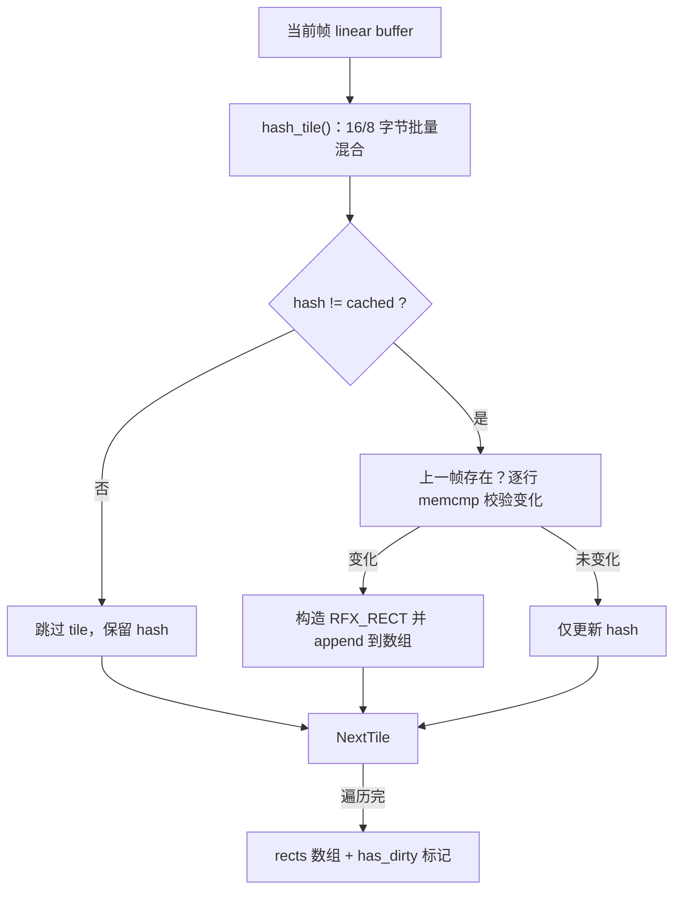

# collect_dirty_rects 机制分析

## 背景
- 模块定位：`collect_dirty_rects()` 位于 `src/encoding/drd_rfx_encoder.c`，作为 RFX 编码前的差分筛选器，只为真正变动的 tile 生成 `RFX_RECT` 列表，配合 Progressive/SurfaceBits 共同减少冗余编码。
- 设计目标：在不牺牲画质的前提下最大限度复用上一帧结果，通过哈希+按需逐行比较的方式避开整帧 `memcmp`，同时与 RFX 64×64 tile 对齐，保证抽象简洁（KISS）且不引入额外的 buffer（YAGNI）。

## 函数输入/输出
- 输入：当前帧 linear 缓冲、上一帧线性缓冲（可空）、行步长 `stride`、`tile_hashes` 缓存、`rects` 动态数组。
- 输出：布尔值表示本帧是否存在至少一个脏矩形，同时 `rects` 填充所有变动 tile。
- 与编码器关系：非关键帧路径中先调用该函数；若返回 `FALSE`，编码器将直接构造 “空帧” 输出并跳过 `rfx_encode_message()`，否则只编码 `rects` 范围内的数据。

## 算法实现
1. **网格遍历**：以 64×64 tile 步长扫描整帧，边界 tile 自动裁剪（MIN）。tile 数等同 `tiles_x * tiles_y`，与 RFX tile 索引完全一致，避免额外映射（DRY）。
2. **哈希计算**：`hash_tile()` 遍历 tile 每行，优先按 16、8 字节块加载并调用 `drd_mix_chunk()`（64bit 混合函数），尾部长度会编码到 chunk 中，减少碰撞。
3. **快路径判定**：哈希未变化则立即跳过。变化时若 `previous` 为空（如第一帧或键帧后），直接认定为脏块，保证单一职责（SOLID-S）。
4. **逐行校验**：存在上一帧时才触发逐行 `memcmp`，以 `tile_w * 4` 字节粒度比较；只要行内有差异即提前终止，避免遍历完全部像素。
5. **结果输出**：确认差异后构造 `RFX_RECT{x,y,w,h}` 追加到 `rects`，并将最新 hash 写回 `tile_hashes`，供下一帧复用。

## 性能优势
- **CPU 友好**：哈希阶段只读当前帧，`previous` 仅在哈希改变时访问；对于静态画面，绝大部分 tile 不再造成双倍内存带宽。
- **缓存命中率高**：逐行比较严格按 stride 连续访问，避免打散访问上一帧；同时 `rects` 使用 `g_array_sized_new()` 预留最大容量，减少扩容与拷贝。
- **无额外分块**：脏矩形天生按 64×64 对齐，可直接送入 `rfx_encode_message()`，不需要重新拆分/合并，符合 YAGNI。
- **空帧短路**：返回值 FALSE 直接让编码器跳过 RFX pipeline（stream 构造与 RLGR 编码），极大节约空闲帧 CPU、内存与网络带宽。

## 进一步优化方向
- 现有逐行校验在 stride == `width * 4` 时仍循环多次 `memcmp`。可在对齐条件满足时一次性比较整个 tile 缓冲，交由 libc 使用向量化指令，进一步降低热点路径 CPU 占用并遵循 KISS。

## 结论
`collect_dirty_rects()` 通过“哈希缓存 + 按需校验 + tile 对齐矩形”三段式实现了高效、低耦合的帧差分。它让 `DrdRfxEncoder` 在静态画面下几乎零开销运行，同时在画面快速变化时仍能准确捕获变更范围，为 Progressive/SurfaceBits 提供最小输入集合，是当前编码链路中的关键性能支点。
