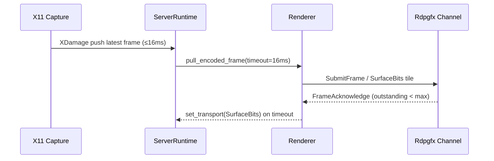

```mermaid
sequenceDiagram
    participant Capture as X11 Capture
    participant Runtime as ServerRuntime
    participant Renderer
    participant Rdpgfx as Rdpgfx Channel
    Capture->>Runtime: XDamage push latest frame (≤16ms)
    Runtime->>Renderer: pull_encoded_frame(timeout=16ms)
    Renderer->>Rdpgfx: SubmitFrame / SurfaceBits tile
    Rdpgfx-->>Renderer: FrameAcknowledge (outstanding < max)
    Renderer-->>Runtime: set_transport(SurfaceBits) on timeout
```