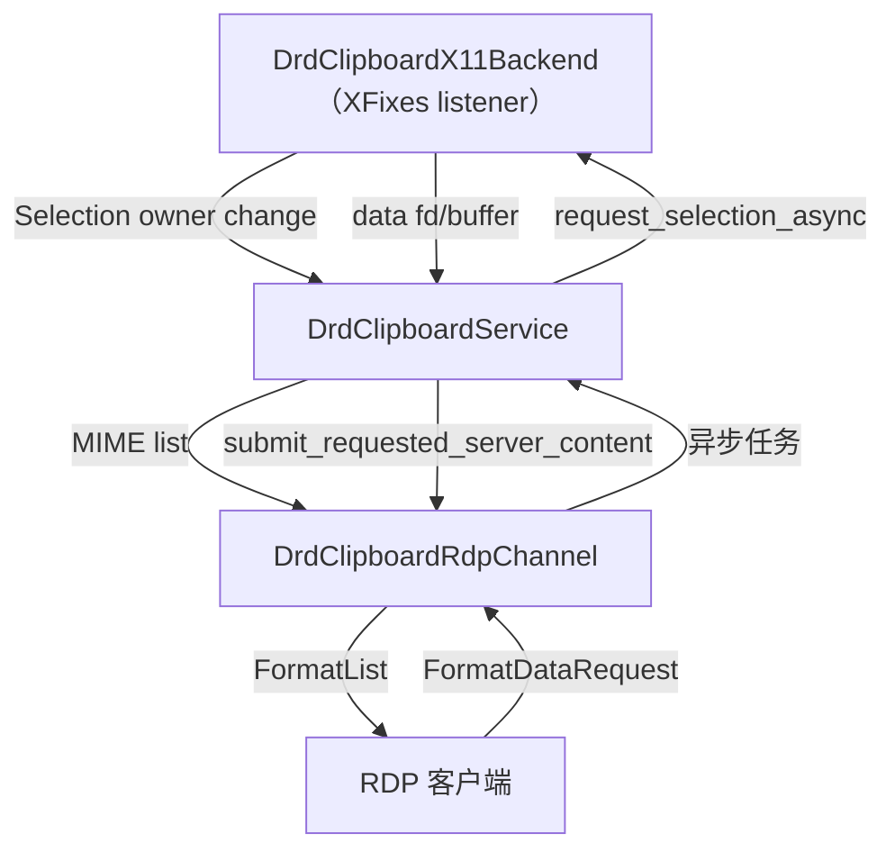

# glib-rewrite 剪贴板实现方案
- codex resume 019a8147-f235-7ca3-8cf5-d8fe6580bf41
## 目标与约束
- **运行时环境**：全部逻辑运行在 X11，基于 `Xlib` + `XFixes` + `XDamage`/`XRender` 提供的 Selection 监听能力；不依赖 Mutter 或 xdg-desktop-portal。
- **协议范围**：首期聚焦文本（`text/plain;charset=utf-8`、`text/html`）与常见位图（`image/png`、`image/jpeg`）格式，优先保证与 FreeRDP `cliprdr` 通道互通；文件列表、FUSE bridge 等延后（YAGNI）。
- **性能隔离**：剪贴板同步以独立线程 + `GMainContext` 运行，不阻塞捕获/编码线程，也不与输入分发（`DrdInputDispatcher`）共用锁，确保帧发送与事件注入链路零耦合。
- **可维护性**：设计沿用 GNOME upstream 的 `GrdClipboard`/`GrdClipboardRdp` 思路，但模块更细，遵循 SOLID/KISS/DRY，避免在会话对象上堆叠杂项状态。

## GNOME upstream 参考摘要
- `GrdClipboard` 维护服务器/客户端 MIME 映射、读写状态与 4s 超时，利用 `GTask` + `GCancellable` 异步拉取数据，防止 `cliprdr` 回调阻塞。
- `GrdClipboardRdp` 独立于 `GrdRdpSession`，负责 cliprdr 通道生命周期、格式白名单、缓存以及与 `winpr/clipboard` 的转换，必要时通过 FUSE 冷存文件数据。
- 会话层通过 `grd_session_enable_clipboard()`/`grd_session_set_selection()` 将剪贴板注册到 Mutter/portal 提供的 selection 管理，当 Wayland 会话无法启用时自动降级。
- 该结构成功隔离了剪贴板与帧发送/输入线程，只需按需复用其状态机与 MIME 处理策略即可。

## glib-rewrite 方案概览
### 模块划分
1. **`DrdClipboardService`（GObject）**：抽象 GNOME 的 `GrdClipboard`，管理 MIME 表、序列号、异步读取状态与超时；对外暴露 `drd_clipboard_service_update_server_mime_types()`、`*_request_server_content_async()` 等 API，供 RDP/未来 VNC 后端共用。
2. **`DrdClipboardX11Backend`**：独立对象，持有 `Display *`、`Window` 与 `GSource`，通过 `XFixesSelectSelectionInput()` 监听 `CLIPBOARD`/`PRIMARY` 所有权变化；提供 `drd_clipboard_x11_export()` & `*_request_selection_async()`，所有阻塞式 `XConvertSelection` 操作都跑在线程池任务中。
3. **`DrdClipboardRdpChannel`**：封装 FreeRDP `CliprdrServerContext`，负责 FormatList、FormatData 请求/响应，缓存允许的格式，并通过信号与 `DrdClipboardService` 交互。该模块跟随 `DrdRdpSession` 生命周期创建/销毁。
4. **`DrdClipboardMimeRegistry`**：集中维护 MIME ↔ clipboard formatID ↔ `winpr` type 的映射，供 RDP/X11 侧共享，避免重复编码。

各模块均通过接口/信号沟通，遵循单一职责（S）与依赖倒置（D）：`DrdClipboardService` 仅依赖抽象的 `DrdClipboardBackend`/`DrdClipboardChannel` 接口，便于未来接入 VNC 或 Wayland。

### 线程与事件模型
- 在 `drd_server_runtime_prepare_stream()` 成功后，新建 `DrdClipboardLoop`：内部创建 `GMainContext` + `GMainLoop` 与工作线程，`DrdClipboardX11Backend` 与 `DrdClipboardService` 都附着在该 context。
- `DrdClipboardRdpChannel` 继续运行在 FreeRDP vcm 线程，但所有耗时操作（例如读取 X11 selection、重编码数据）都通过 `g_main_context_invoke_full()`/`g_task_run_in_thread()` 跳转到剪贴板线程，cliprdr 回调只做排队，从而不影响图形/输入回调。

### 数据流

- **本地→远端**：X11 selection 变化 → `DrdClipboardX11Backend` 收集 targets 与序列 → `DrdClipboardService` 转换为 `DrdMimeTypeTable` → `DrdClipboardRdpChannel` 发送 FormatList。
- **远端→本地**：cliprdr `FormatDataRequest` → `DrdClipboardRdpChannel` 通知 service → service 调用 backend 异步读取 selection → 数据到齐后写回 cliprdr `FormatDataResponse`。

## X11 后端细节
- 使用 `XFixesSelectSelectionInput()` 监听 `SelectionNotify/SelectionRequest/SelectionClear`，在独立 `GSource` 内解析事件。
- 读取流程仿照 GNOME：`pipe()` 创建本地 fd，并把 fd 封装成 `GUnixInputStream` 给 `GTask` 背景线程写入，主线程等待 `MAX_READ_TIME_MS`（4s）超时。
- 写入（远端→本地）场景通过 `XSetSelectionOwner()` + `XChangeProperty()` 提供数据，同时响应外部 `SelectionRequest`，确保无 portal 也能与任意 X11 客户端交互。
- 依赖的仅是 `libX11` + `libXfixes`（可选 `libxcb`），满足“无 Mutter/xdg-desktop-portal”约束。

## RDP cliprdr 细节
- 在 `drd_rdp_session_post_connect()` 内向 `CliprdrServerContext` 注册回调，实例化 `DrdClipboardRdpChannel`，并把 `DrdClipboardService` 指针放入 `RdpPeerContext`。
- `FormatList` 事件触发时调用 `drd_clipboard_service_update_client_mime_types()`，内部缓存序列并唤醒 `DrdClipboardX11Backend` 写入 selection。
- `FormatDataRequest` 经过 service → backend 异步读取后，由 channel 调用 `cliprdr_context->ServerFormatDataResponse()` 回传数据。
- 为避免 cliprdr 回调阻塞 VCM 线程，channel 中只把请求排入 `GAsyncQueue` 并立即返回；真正的数据交换由剪贴板线程消费队列。
- 响应 `CB_MONITOR_READY` 时发送初始 FormatList，保持与 GNOME 行为一致；文件列表等高阶特性留待后续。

## 与现有模块的集成
- `DrdRdpSession` 新增成员 `DrdClipboardService *clipboard_service`，在 session 准备成功且 `DrdServerRuntime` 已启动后创建。
- Service 与 `DrdServerRuntime` 通过新的 `drd_server_runtime_get_main_context()` 返回的 IO context 互不干扰；帧/输入线程不持有任何剪贴板锁。
- 配置层在 `drd_config` 中加入 `clipboard.enable` 与允许的 MIME 列表；若禁用则完全不建立 cliprdr。

## 实施步骤
1. **基础设施**：新增 `src/clipboard/` 目录，完成 `DrdClipboardService`/`DrdClipboardMimeRegistry` API 及单元测试（纯内存，便于验证状态机）。
2. **X11 backend**：实现事件监听、selection 读写与异步任务；在 headless CI 里借助 `xvfb-run` 做冒烟测试。
3. **RDP channel**：封装 cliprdr 回调，打通 service ↔ channel 数据流；本地端通过 FreeRDP 客户端验证文本/HTML 同步。
4. **Session wiring**：`drd_rdp_session.c` 在 `post_connect` 创建 service/backends，并在 `dispose` 时干净销毁。
5. **扩展测试**：编写 `meson test` 针对 MIME 映射与超时；脚本记录常见格式互操作结果。

## 风险与对策
- **X11 事件驱动复杂**：封装在单文件，并使用大量自测覆盖 selection 流程；文档示例可直接映射 GNOME upstream 实现。
- **大对象传输耗时**：沿用 4s 超时 + `GCancellable`，并在服务层提供最大尺寸配置（超过直接拒绝）。
- **cliprdr 回调竞态**：使用 `GAsyncQueue` + 序列号校验，并在 session 停止时广播取消，防止 use-after-free。

## 预期收益
- 剪贴板同步成为独立子系统，满足 X11/无 portal 场景；后续引入 Wayland backend 只需实现新的 backend 接口。
- 帧与输入线程无需感知剪贴板状态，降低调试难度，也符合 KISS/DRY。
