# RDPGFX 图形管线（PipeWire → Encoder → FreeRDP）详解

本文逐层描述 `gnome-remote-desktop-48.0` 中 RDPGFX 流水线的函数调用链、GSource 回调、信号交互以及关键数据结构，覆盖 PipeWire 捕获、脏区检测、视图/编码器选择、FreeRDP 发送以及网络自适应节流。

---

## 1. PipeWire 捕获链（事件 → GSource → Renderer）

| 顺序 | 触发 / 回调 | 主要函数 | 说明 |
| --- | --- | --- | --- |
| 1 | PipeWire 连接 | `connect_to_stream()`（`src/grd-rdp-pipewire-stream.c:1000`） | 调用 `pw_stream_new()` 并注册 `stream_events`，其中 `.add_buffer/.remove_buffer/.process` 分别指向 `on_stream_add_buffer()`、`on_stream_remove_buffer()`、`on_stream_process()`。 |
| 2 | `pw_stream` 分配缓冲 | `on_stream_add_buffer()`（`#L500`） | 把 `pw_buffer` 包装为 `GrdRdpPwBuffer`，调用 `grd_rdp_surface_renderer_register_pw_buffer()` 将 DRM FourCC 与 modifier 记录到 SurfaceRenderer 的 `registered_buffers`；若注册失败会回调 `handle_graphics_subsystem_failure()`。 |
| 3 | PipeWire 推送帧 | `on_stream_process()`（`#L922`） | 在 `dequeue_mutex` 下执行 `pw_stream_dequeue_buffer()`，按需剔除 `SPA_META_HEADER_FLAG_CORRUPTED`。带鼠标图像的数据交给 `process_mouse_cursor_data()`，带视频数据的缓冲在末尾落到 `process_frame_data()`（DMA-BUF/NV12）或 `submit_framebuffer()`（SHM/CPU）。 |
| 4 | DMA-BUF 写入 Legacy Buffer | `process_frame_data()`（`#L725`） | ① 锁定 PipeWire buffer (`acquire_pipewire_buffer_lock`)；② 从 `GrdRdpBufferPool` 取得 `GrdRdpLegacyBuffer`，必要时在 EGL 线程运行 `allocate_buffer_data` / `cuda_map_resource` 注册 PBO；③ 根据 `pw_buffer->datas[0].type` 执行 DMA-BUF 导入或内存拷贝；④ 通过 `grd_rdp_surface_renderer_submit_buffer()`（见下一节）把帧塞给 SurfaceRenderer，并为 PipeWire 侧建立 `GrdRdpFrame`（包装 `GrdRdpLegacyBuffer`，回调 `on_frame_ready()` 负责归还 buffer）。 |
| 5 | SHM/CPU 路径 | `submit_framebuffer()`（同文件） | 当 `grd_get_debug_flags()` 强制 CPU 或缺少 NVENC/VAAPI 时，PipeWire 帧直接塞入 `GrdRdpSurface::pending_framebuffer`，后续由 `maybe_encode_pending_frame()` 走纯 CPU 流程。 |

> **信号 / 锁**：PipeWire 事件发生在 PipeWire 线程；所有对 SurfaceRenderer 的调用都只在持有 `dequeue_mutex` 的上下文中执行，以保证 buffer 状态在 Renderer 线程处理前保持一致。

---

## 2. SurfaceRenderer → RenderContext（脏区检测与帧拼装）

### 2.1 数据流
1. **缓存 pending buffer**  
   - `grd_rdp_surface_renderer_submit_buffer()`（`src/grd-rdp-surface-renderer.c:309`）把 `GrdRdpBuffer` 设为 `pending_buffer`，并 `g_source_set_ready_time(render_source, 0)` 唤醒同文件创建的 `render_source` GSource。

2. **graphics 线程回调**  
   - `maybe_render_frame()`（`#L648`）在 Renderer 的 graphics 线程里运行：  
     - 检查 `pending_buffer` / `pending_framebuffer` 是否存在；  
     - 若 `total_frame_slots`（由 FrameController 调整）已满，直接返回；  
     - 如需重建上下文（`pending_render_context_reset`）则以 `GRD_RDP_ACQUIRE_CONTEXT_FLAG_FORCE_RESET` 调用 `grd_rdp_renderer_try_acquire_render_context()`；  
     - **Legacy SHM 分支**：当 PipeWire 走 CPU 路径时，`pending_buffer == NULL` 且 `rdp_surface->pending_framebuffer` 非空，执行 `maybe_encode_pending_frame()`：  
       1. 将 `GrdRdpLegacyBuffer` 传给 `GrdRdpDamageDetector` 生成 `damage_region`；  
       2. 若有脏区则调用 `grd_rdp_renderer_render_frame()`，由 GraphicsPipeline 直接读取 CPU buffer 并走 RemoteFX/其他 codec；  
       3. 无论是否编码成功，都会释放 `pending_framebuffer`，并在失败时触发 `handle_graphics_subsystem_failure()` 通知 Session 终止。

3. **生成 GrdRdpFrame**  
   - `handle_pending_buffer()`（`#L560`）创建 `GrdRdpFrame`，并设置四个回调：  
     - `on_frame_picked_up()`：记录 `last_buffer` & `assigned_frame_slots`。  
     - `on_view_finalization()`：把当前/旧 buffer 放入 `unref_queue`，让 `buffer_unref_source` 异步释放 PipeWire 锁（避免 graphics 线程阻塞）。  
     - `on_frame_submission()`：更新 session metrics 并触发 `trigger_frame_upgrade_schedule()`。  
     - `on_frame_finalization()`：从 `assigned_frame_slots` 移除帧，并再次唤醒 `render_source`。

4. **CPU 路径的脏区检测**  
   - SHM buffer 通过 `grd_rdp_surface_renderer_submit_legacy_buffer()` 放进 `GrdRdpSurface::pending_framebuffer`。  
   - `maybe_encode_pending_frame()` 在 `render_source` 回调中调用 `grd_rdp_damage_detector_submit_new_framebuffer()`（`src/grd-rdp-damage-detector-*.c`），选择 CUDA 或 memcmp 比对 tile → 生成 `cairo_region_t damage_region`。若区域为空，则直接 `grd_rdp_legacy_buffer_release()` 跳过编码。  
   - 结果写入 `GrdRdpFrame::damage_region`（`src/grd-rdp-frame.c:156`）。View Creator 只需遍历 `damage_region` 内的矩形。

5. **render_context 重建**  
   - `is_render_context_reset_required()` 会在注册新 buffer 时检测 DMA-BUF modifier 或 buffer 类型是否变化；若有变化则设置 `pending_render_context_reset`，`maybe_render_frame()` 在下一次获取 context 时强制重建 `GrdRdpRenderContext`，以避免旧的 Vulkan/编码资源与新格式不匹配。

### 2.2 函数链（按执行时序）
```
pw_stream_process
  └── process_frame_data / submit_framebuffer
        └── grd_rdp_surface_renderer_submit_buffer / submit_legacy_buffer
              └── (graphics thread) maybe_render_frame GSource
                    ├── grd_rdp_renderer_try_acquire_render_context
                    ├── handle_pending_buffer / maybe_encode_pending_frame
                    │     ├── GrdRdpDamageDetector (CUDA/memcmp)
                    │     └── GrdRdpFrame callbacks (picked_up/finalization/...)
                    └── grd_rdp_renderer_submit_frame
```

---

## 3. 视图创建 / 编码器选择 / 回退

1. **RenderContext 初始化**  
   - `grd_rdp_render_context_new()`（`src/grd-rdp-renderer.c:503`）依据客户端 `FreeRDP_Gfx*` capability 与硬件资源，实例化以下组件：  
     - `GrdRdpGfxSurface`（对应一个 PipeWire Surface）；  
     - `GrdRdpViewCreator`（默认 AVC Vulkan pipeline，或 future 扩展）；  
     - `GrdEncodeSession`（VAAPI、NVENC、或 CPU encoder）；  
     - `GrdHwAccelVaapi` / `GrdHwAccelVulkan` / `GrdHwAccelNvidia` 句柄。
2. **编码器分支**  
   | Codec | 触发条件 | 关键代码 | 回退策略 |
   | --- | --- | --- | --- |
   | NVENC AVC420/444 | `have_avc420/avc444 && hwaccel_nvidia` | `grd_rdp_graphics_pipeline_create_surface()` 在 Surface 创建时尝试 `grd_hwaccel_nvidia_create_nvenc_session()`，并把 session id 挂在 `surface_hwaccel_table`。 | 如 `grd_hwaccel_nvidia_avc420_encode_bgrx_frame()` 失败，`refresh_gfx_surface_avc420()` 会返回 FALSE，随后 `grd_rdp_graphics_pipeline_refresh_gfx()` 触发 `handle_graphics_subsystem_failure()`，会通知 session 结束，防止继续推无效帧。 |
   | Vulkan + VAAPI | 无 NVENC 但成功初始化 `GrdHwAccelVulkan`/`GrdHwAccelVaapi` | `maybe_initialize_hardware_acceleration()`（`src/grd-rdp-renderer.c:168`） | 若 `GrdEncodeSessionVaapi` 创建失败，会 fallback 到 CPU RFX。 |
   | CPU RemoteFX | 客户端不支持 H.264，或所有 GPU encoder 不可用 | `grd_rdp_render_context_new()` 选择 `GRD_RDP_CODEC_CAPROGRESSIVE`，`refresh_gfx_surface_rfx_progressive()` 打包 RFX tiles（`src/grd-rdp-graphics-pipeline.c:1297`）。 | RFX 是最后的兜底方案，若失败直接终止 session。 |
3. **视图升级 / 降级**  
   - SurfaceRenderer 根据 `total_frame_slots`、`assigned_frame_slots` 与 `unthrottled_since_us` 判定是否可发送 stereo（AVC444）辅助视图（`should_avoid_auxiliary_frame()` + `maybe_upgrade_frame()`）。  
   - `GrdRdpRenderContext_should_avoid_stereo_frame()` 通过 `GrdRdpGfxFramerateLog` 判定是否需要暂时禁用 stereo（例如 ACK 太慢）。  
   - 所有升级操作都会走 `render_source` 的 `maybe_upgrade_frame()` → `GRD_RDP_ACQUIRE_CONTEXT_FLAG_RETAIN_OR_NULL`，如果 context 已被其他帧占用，则推迟到下一次。

---

## 4. GraphicsPipeline & FreeRDP 提交链

### 4.1 渲染 → 发送
```
grd_rdp_renderer_submit_frame
  ├── queue_prepared_frame（view 已完成）
  └── surface_render_source（view 未完成 → finish_views)
        └── grd_rdp_renderer_render_frame
              └── grd_rdp_graphics_pipeline_refresh_gfx
                    ├── refresh_gfx_surface_avc420/avc444/rfx_progressive
                    ├── rdpgfx_context->StartFrame
                    ├── rdpgfx_context->SurfaceCommand (+ SurfaceToSurface)
                    └── rdpgfx_context->EndFrame
```

### 4.2 发送细节
- `refresh_gfx_surface_avc420()`（`src/grd-rdp-graphics-pipeline.c:1001`）：
  1. 调用 `grd_hwaccel_nvidia_avc420_encode_bgrx_frame()` 生成 bitstream；
  2. `grd_hwaccel_nvidia_avc420_retrieve_bitstream()` 返回 main/aux view 的 `data/length`；
  3. 使用 `grd_rdp_damage_detector_get_damage_region()` 的矩形填充 `RDPGFX_H264_METABLOCK.regionRects`；
  4. 写入 `StartFrame::frameId`、`StartFrame::timestamp`、`SurfaceCommand::codecid`。
- `refresh_gfx_surface_rfx_progressive()` 会调用 FreeRDP 提供的 RemoteFX 例程，把 tile 数据写入 `RDPGFX_SURFACE_COMMAND`。
- 若 Surface 有额外 `render_surface`（NVENC 对齐），在 `SurfaceCommand` 之后调用 `blit_surface_to_surface()`（`#L1170`）。
- 每个帧会存入 `frame_serial_table`（frameId → surface_serial），同时入 `encoded_frames` 队列，用于统计编码速率。

### 4.3 PipeWire buffer 归还
- `on_frame_ready()`（PipeWire 侧）在 Encoder / GraphicsPipeline 完成后调用 `pw_stream_queue_buffer()`，依赖 `GrdRdpFrame` 的引用计数从 `unref_queue` 走 `rdp_buffer_unref()`，确保 DMA-BUF 锁已释放。

---

## 5. ACK & 网络自适应链路

| 阶段 | 函数 | 行为 |
| --- | --- | --- |
| 帧发送后 | `grd_rdp_network_autodetection_try_bw_measure_start()`（`src/grd-rdp-graphics-pipeline.c:965`） | 当帧大小 ≥ `MIN_BW_MEASURE_SIZE` 时启动带宽测量，发送完毕后调用 `grd_rdp_network_autodetection_queue_bw_measure_stop()`。 |
| 客户端 ACK | `rdpgfx_frame_acknowledge()` → `handle_frame_ack_event()`（`#L1835`） | 根据 `frameId` 找到 `surface_serial`，再定位 `GrdRdpGfxFrameController`：<br> - `grd_rdp_gfx_frame_controller_ack_frame()` 更新 enc/ack rate，必要时恢复 `UNLIMITED_FRAME_SLOTS`；<br> - `queueDepth == SUSPEND_FRAME_ACKNOWLEDGEMENT` 时调用 `suspend_frame_acknowledgement()` 清空历史。 |
| RTT 更新 | `GrdRdpNetworkAutodetection` → `grd_rdp_graphics_pipeline_notify_new_round_trip_time()`（`#L870`） | 将 RTT 推送给所有 Surface 的 FrameController，`get_activate_throttling_th_from_rtt()` 会调整触发阈值，使节流标准与网络状态同步。 |
| 节流控制 | `grd_rdp_gfx_frame_controller_unack_frame()` / `ack_frame()`（`src/grd-rdp-gfx-frame-controller.c`） | 根据未 ACK 帧数和 RTT 决定 `total_frame_slots`：<br> - ≥ `activate_throttling_th` → 把 slot 设为 0，SurfaceRenderer 不再消费 PipeWire buffer；<br> - ≤ `deactivate_throttling_th` → 解除限制，允许 `maybe_render_frame()` 继续取帧。 |

---

## 6. 端到端调用图（Mermaid）

```mermaid
flowchart LR
  subgraph PipeWire线程
    A1[stream_events.add_buffer\non_stream_add_buffer] --> A2[register_pw_buffer]
    A3[stream_events.process\non_stream_process] -->|DMA-BUF| A4[process_frame_data]
    A3 -->|SHM| A5[submit_framebuffer]
    A4 --> B1[grd_rdp_surface_renderer_submit_buffer]
    A5 --> B2[grd_rdp_surface_renderer_submit_legacy_buffer]
  end

  subgraph Graphics线程
    B1 --> C1[render_source\nmaybe_render_frame]
    B2 --> C1
    C1 --> C2[handle_pending_buffer]
    C1 --> C3[maybe_encode_pending_frame （CPU）]
    C2 --> D1[GrdRdpFrame callbacks]
    C2 --> D2[grd_rdp_renderer_submit_frame]
    C3 --> D2
    D2 --> E1[grd_rdp_renderer_render_frame]
    E1 --> F1[grd_rdp_graphics_pipeline_refresh_gfx]
    F1 --> G1[FreeRDP RdpgfxServerContext\nStartFrame/SurfaceCommand/EndFrame]
  end

  G1 --> H1[FrameAcknowledge\nrdpgfx_frame_acknowledge]
  H1 --> I1[GrdRdpGfxFrameController\nupdate total_frame_slots]
  I1 --> C1
  F1 -.RTT/BW.-> J1[GrdRdpNetworkAutodetection]
  J1 --> I1
```


---

## 7. 使用与调试建议
1. **定位卡顿**：在 `grd_rdp_gfx_frame_controller_unack_frame()` 与 `ack_frame()` 处添加 `g_debug()`，可观测节流的阈值、当前 `total_frame_slots` 以及 enc/ack 速率，排查是网络瓶颈还是编码慢。
2. **扩展编码器**：若要增加新的 GPU/CPU encoder，仅需在 `grd_rdp_render_context_new()` 注册新的 `GrdEncodeSession` + `GrdRdpViewCreator`，并在 `grd_rdp_graphics_pipeline_refresh_gfx()` 添加对应的 `refresh_gfx_surface_*` 分支，PipeWire / DamageDetector / Ack 链保持不变。
